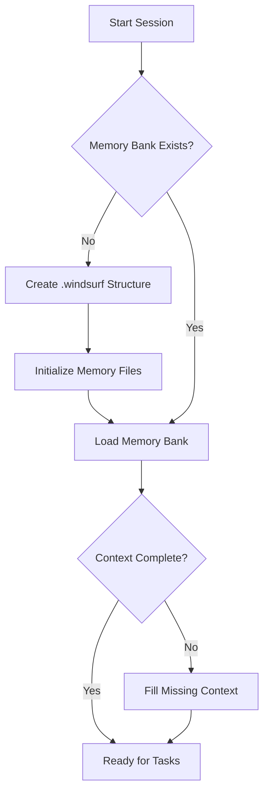
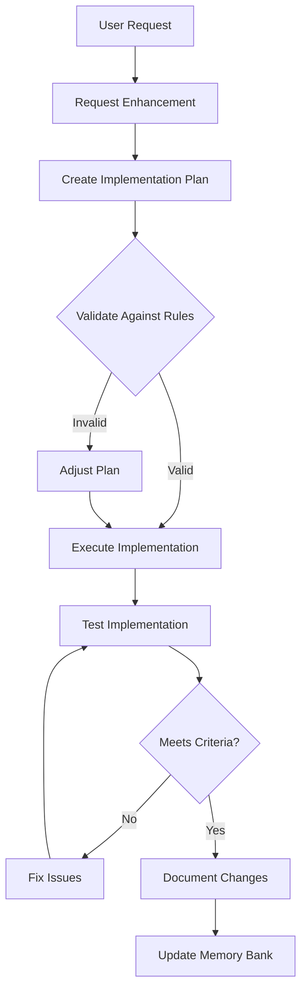
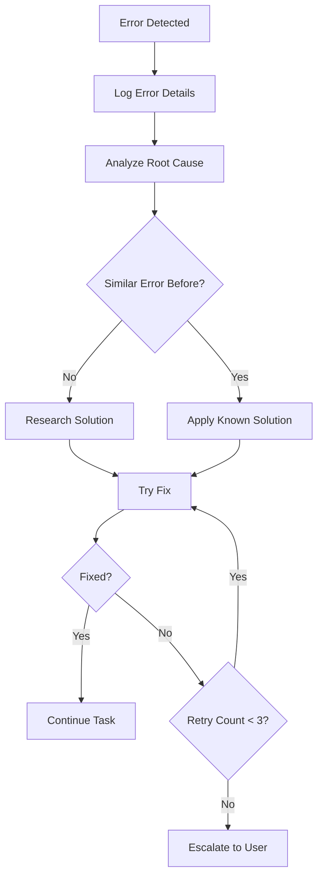
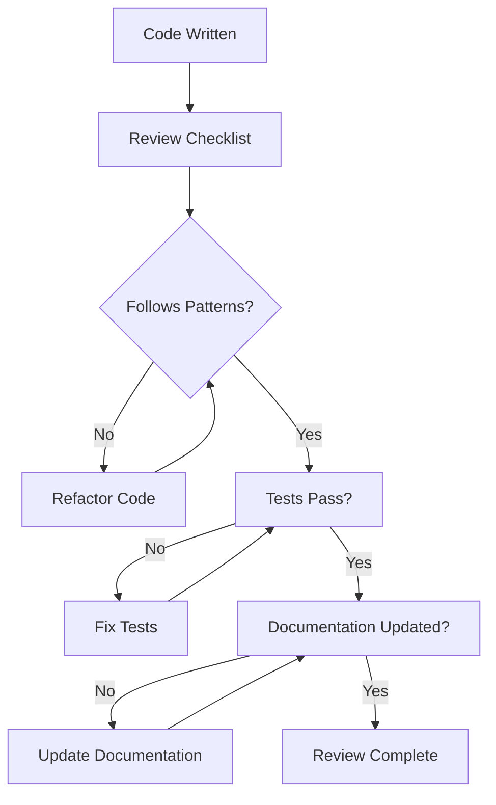
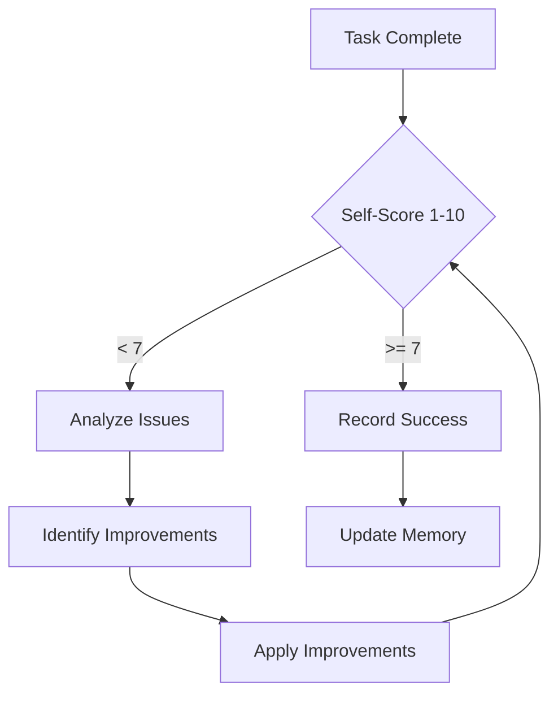

# CleanConnect Workflow Documentation

## Workflow Overview

This document outlines the engineered workflows for CleanConnect development, designed specifically for a non-technical founder using Cascade/Windsurf for vibe coding.

## Core Workflow Diagrams

### 1. Initialization Workflow

### 2. Task Execution Workflow

### 3. Error Recovery Workflow

## Detailed Workflows

### Session Initialization Workflow

**Purpose**: Set up the development environment for productive work.

**Steps**:
1. **Check Directory Structure**
   - Verify `.windsurf/` exists
   - Create missing directories:
     - `.windsurf/core/`
     - `.windsurf/active/`
     - `.windsurf/plans/`
     - `.windsurf/errors/`
     - `.windsurf/sessions/`

2. **Initialize Memory Bank**
   - Check if core memory files exist
   - Create missing files with available project info
   - Load all memory layers

3. **Verify Memory Consistency**
   - Check file checksums in `memory-index.md`
   - Identify conflicts or gaps
   - Create session memory entry

4. **Establish Context**
   - Read `activeContext.md` for current work
   - Review recent session summaries
   - Set session objectives

### Request Enhancement Workflow

**Purpose**: Transform user requests into well-structured tasks.

**Trigger**: Every user message (except `/no-enhance`)

**Steps**:
1. **Analyze Request**
   - Identify core intent
   - Detect implicit requirements
   - Assess technical complexity
   - Map to V1 checklist items

2. **Enhance Structure**
   - Add clear objectives
   - Include business context
   - Specify constraints
   - Define success criteria

3. **Validate Against Rules**
   - Check architecture compliance
   - Verify development phase alignment
   - Ensure tenant scoping considered
   - Confirm fixed stack usage

4. **Create Action Plan**
   - Break into manageable steps
   - Identify dependencies
   - Estimate complexity/time
   - Plan testing approach

### Implementation Workflow

**Purpose**: Execute tasks following CleanConnect standards.

**Steps**:
1. **Pre-Implementation**
   - Read relevant files
   - Consult documentation
   - Load patterns from memory
   - Create implementation plan

2. **Code Implementation**
   - Follow Zapier-style layering
   - Enforce tenant scoping
   - Use proper error handling
   - Add logging/observability

3. **Quality Assurance**
   - Run relevant tests
   - Check code quality
   - Verify documentation
   - Validate against rules

4. **Post-Implementation**
   - Update memory bank
   - Document changes
   - Record lessons learned
   - Plan next steps

### Error Handling Workflow

**Purpose**: Systematically resolve issues and learn from them.

**Steps**:
1. **Error Detection**
   - Catch tool failures
   - Identify validation errors
   - Notice unexpected behavior
   - Log all errors

2. **Error Analysis**
   - Document full error context
   - Check error patterns in memory
   - Research root causes
   - Assess impact

3. **Resolution Strategy**
   - Apply known solutions if available
   - Research documentation
   - Try minimal fixes first
   - Escalate if stuck

4. **Learning & Prevention**
   - Document error patterns
   - Update error handling rules
   - Add preventive checks
   - Share learnings

## Quality Control Workflows

### Code Review Workflow

### Performance Evaluation Workflow

## Communication Workflows

### Progress Update Workflow
1. **Status Summary**
   - Clear, non-technical language
   - Progress percentage
   - Current focus area

2. **Accomplishments**
   - What was completed
   - Why it matters
   - Business value delivered

3. **Next Steps**
   - Immediate actions
   - Expected outcomes
   - Any decisions needed

4. **Risk Assessment**
   - Current risk level
   - Potential blockers
   - Mitigation strategies

### Decision Request Workflow
1. **Context**
   - Background information
   - Options available
   - Pros/Cons of each

2. **Recommendation**
   - Suggested approach
   - Reasoning
   - Confidence level

3. **Call to Action**
   - Specific decision needed
   - Impact of decision
   - Timeline considerations

## Automation Triggers

### Automatic Behaviors
- Request enhancement on every message
- Memory bank updates after tasks
- Error logging on failures
- Progress tracking

### Manual Triggers
- `/no-enhance` - Skip request enhancement
- `/review` - Force code review
- `/docs` - Update documentation
- `/memory` - Check memory status

## Integration with Project Structure

### Plan Integration
- Map tasks to `plan/PLAN_INDEX.md`
- Follow numbered folder sequence
- Reference playbooks as needed
- Update checklists

### Documentation Integration
- Update `docs/` as needed
- Maintain AGENTS.md accuracy
- Keep architecture docs current
- Document decisions

### Package Integration
- Respect monorepo structure
- Use proper package references
- Follow build order
- Test in isolation

## Success Indicators

### Workflow Health Metrics
- Task completion rate
- Error recovery time
- Memory consistency score
- Documentation completeness

### Development Velocity
- Features delivered per session
- Blocker resolution speed
- Code quality score
- Test coverage percentage

## Continuous Improvement

### Workflow Optimization
- Regular workflow reviews
- Identify bottlenecks
- Automate repetitive tasks
- Simplify complex processes

### Learning Integration
- Capture success patterns
- Document failure modes
- Update best practices
- Share insights across sessions
