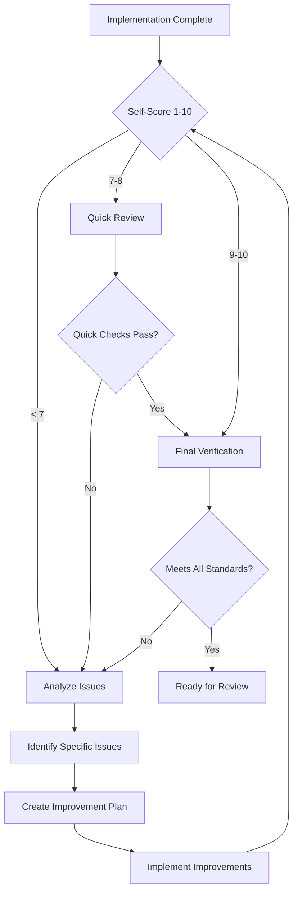
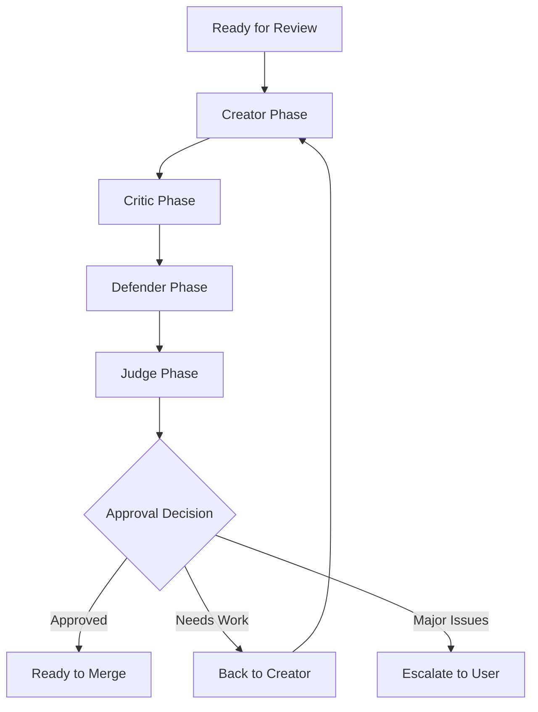

# Evaluation and Quality Control Workflow

## Purpose
Ensure every implementation meets CleanConnect's high standards through systematic evaluation and continuous improvement.

## Quality Control Checklist

### Pre-Implementation Checklist
- [ ] **Requirements Clear**: Success criteria defined and measurable
- [ ] **Architecture Compliant**: Follows Zapier-style layering
- [ ] **Tenant Scoped**: All operations include organizationId
- [ ] **Dependencies Checked**: Required packages available
- [ ] **Risk Assessed**: Potential issues identified with mitigation

### Code Quality Checklist
- [ ] **TypeScript Strict**: No `any` types, proper typing throughout
- [ ] **Error Handling**: Proper try/catch with structured errors
- [ ] **Validation**: Input validation with Zod schemas
- [ ] **Logging**: Structured logs with correlation IDs
- [ ] **Security**: No exposed secrets, proper auth checks

### Testing Checklist
- [ ] **Unit Tests**: Core business logic covered
- [ ] **Integration Tests**: API endpoints tested
- [ ] **Edge Cases**: Error scenarios handled
- [ ] **Tenant Isolation**: Data separation verified
- [ ] **Performance**: Response times acceptable

### Documentation Checklist
- [ ] **Code Comments**: Complex logic explained
- [ ] **API Docs**: Endpoints documented
- [ ] **README Updated**: Setup instructions current
- [ ] **Memory Bank**: Context updated with decisions
- [ ] **AGENTS.md**: Rules followed and documented

## Evaluation Workflow

### 1. Self-Evaluation Phase


### 2. Peer Review Phase (Creator-Critic-Defender-Judge)


#### Creator Phase
- Present the implemented solution
- Explain design decisions
- Highlight key features
- Note potential concerns

#### Critic Phase
- Identify weaknesses and edge cases
- Question assumptions made
- Spot security or performance issues
- Suggest improvements

#### Defender Phase
- Address criticisms systematically
- Provide rationale for design choices
- Explain trade-offs made
- Demonstrate robustness

#### Judge Phase
- Compare original requirements
- Evaluate quality of implementation
- Check adherence to standards
- Make final approval decision

### 3. Performance Evaluation

#### Scoring Criteria (1-10 scale)
- **Functionality** (25%): Does it work as specified?
- **Code Quality** (25%): Is it well-written and maintainable?
- **Architecture** (20%): Does it follow established patterns?
- **Testing** (15%): Is it adequately tested?
- **Documentation** (15%): Is it properly documented?

#### Grade Levels
- **9-10**: Exemplary - Exceeds expectations, showcase quality
- **7-8**: Good - Meets all requirements, solid implementation
- **5-6**: Acceptable - Works but needs improvement
- **3-4**: Below Standard - Significant issues present
- **1-2**: Incomplete - Does not meet basic requirements

## Continuous Improvement Process

### 1. Collect Metrics
```typescript
interface QualityMetrics {
  taskCompletionTime: number;
  codeReviewScore: number;
  testCoverage: number;
  bugCount: number;
  userSatisfaction: number;
}
```

### 2. Identify Patterns
- Common failure modes
- Recurring issues
- Best practice examples
- Improvement opportunities

### 3. Update Standards
- Refine checklists based on findings
- Update AGENTS.md with new rules
- Enhance workflow documentation
- Share learnings across project

### 4. Implement Improvements
- Add automated checks where possible
- Create templates for common patterns
- Improve tooling and scripts
- Enhance training materials

## Quality Gates

### Before Commit
- All checklist items completed
- Tests passing at 100%
- Code review approved
- Documentation updated

### Before Deploy
- Integration tests passing
- Security review complete
- Performance benchmarks met
- Rollback plan documented

### Before Release
- User acceptance testing
- Feature flags configured
- Monitoring in place
- Communication ready

## Error Prevention Strategies

### 1. Proactive Checks
- Pre-commit hooks for formatting
- TypeScript strict mode
- ESLint rules enforcement
- Dependency vulnerability scanning

### 2. Automated Testing
- CI/CD pipeline with comprehensive tests
- Automated security scanning
- Performance regression testing
- Cross-browser compatibility checks

### 3. Manual Reviews
- Code review requirements
- Architecture review for changes
- Security review for sensitive changes
- Documentation review for public APIs

## Handling Quality Issues

### Minor Issues (Score 5-6)
1. Document specific issues
2. Create improvement plan
3. Implement fixes
4. Re-evaluate score
5. Learn from mistakes

### Major Issues (Score 3-4)
1. Stop further work
2. Full root cause analysis
3. Consult with team/user
4. May require partial rewrite
5. Update prevention measures

### Critical Failures (Score 1-2)
1. Immediate rollback if deployed
2. Full incident review
3. Communicate impact
4. Implement prevention
5. Update training

## Quality Tracking Dashboard

### Metrics to Track
- Average code review score
- Test coverage percentage
- Bug escape rate
- Mean time to resolution
- Customer satisfaction

### Visualization Ideas
- Score trends over time
- Quality by feature area
- Improvement velocity
- Risk assessment heatmap

## Founder-Friendly Quality Reports

### Weekly Summary
```
📊 Quality Report - Week of [Date]

✅ Wins:
- Feature X completed with 9/10 score
- Test coverage improved to 85%
- No critical bugs found

⚠️ Areas to Watch:
- Feature Y needs refactoring (score: 6/10)
- Test coverage for auth module at 60%

🎯 Next Week:
- Complete refactoring of Feature Y
- Improve auth test coverage to 80%
- Code review for Feature Z
```

### Monthly Review
```
📈 Monthly Quality Review - [Month]

Overall Score: 8.2/10 ⬆️ from 7.8 last month
Test Coverage: 82% ⬆️ from 75% last month
Bug Count: 3 ⬇️ from 5 last month

Top Improvements:
1. Better error handling patterns
2. Improved test coverage
3. Cleaner code architecture

Focus Areas:
1. Performance optimization
2. Security hardening
3. Documentation completeness
```

## Integration with Memory Bank

### Quality Records
- Document all quality scores
- Track improvement patterns
- Note successful strategies
- Remember failure modes

### Learning Integration
- Update best practices
- Refine checklists
- Improve workflows
- Share insights

## Quality Assurance Checklist for AI

### Before Submitting Work
- [ ] Did I follow all AGENTS.md rules?
- [ ] Is the code fully functional?
- [ ] Are tests included and passing?
- [ ] Is documentation updated?
- [ ] Did I score my work honestly?

### After Receiving Feedback
- [ ] Understand all feedback points
- [ ] Create clear improvement plan
- [ ] Implement changes systematically
- [ ] Verify each fix works
- [ ] Learn from the experience

## Remember
- Quality is everyone's responsibility
- Aim for continuous improvement
- Learn from both successes and failures
- Keep the founder's goals in focus
- Progress over perfection, but never compromise on standards
