# CleanConnect - Complete Architecture Blueprint

## 🎯 Project Overview

CleanConnect is a Zapier-inspired enterprise SaaS platform that delivers personalized daily dashboards via SMS. This document provides comprehensive architectural diagrams for developers, investors, and users to understand the complete system.

---

## 🏗️ High-Level System Architecture (Zapier-Style)

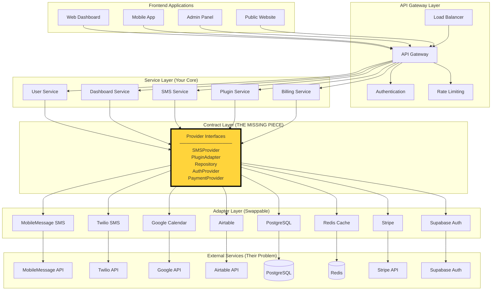

---

## 🔧 Plugin System Architecture (Zapier-Style)

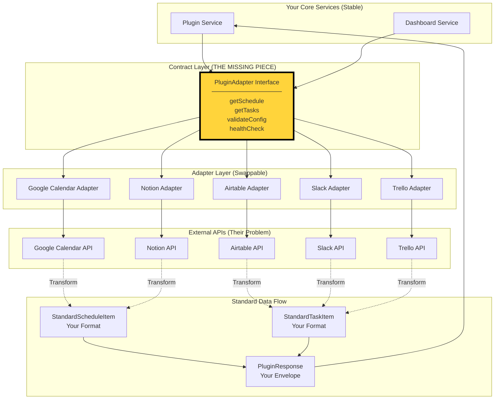

---

## 🔍 Contract Layer Details (What's INSIDE the Interfaces)

### SMSProvider Contract Fields

```mermaid
graph TB
    subgraph "SMSProvider Interface"
        SMSContract[SMSProvider Contract]
        
        subgraph "Input: SMSMessage"
            SMSMsg[SMSMessage<br/>├─ to: string<br/>├─ body: string<br/>├─ from?: string<br/>├─ metadata?: Record<br/>├─ scheduledFor?: Date<br/>├─ priority?: 'low|normal|high'<br/>└─ tags?: string[]]
        end
        
        subgraph "Output: SMSResult"
            SMSRes[SMSResult<br/>├─ success: boolean<br/>├─ messageId: string<br/>├─ provider: string<br/>├─ timestamp: string<br/>├─ cost?: number<br/>├─ error?: string<br/>├─ errorType?: enum<br/>└─ deliveryReport?: object]
        end
        
        subgraph "Methods"
            Methods[├─ send(message): Promise<SMSResult><br/>├─ getStatus(messageId): Promise<SMSStatus><br/>├─ validateConfig(): Promise<Validation><br/>└─ getHealthCheck(): Promise<Health>]
        end
    end
    
    SMSContract --> SMSMsg
    SMSContract --> SMSRes
    SMSContract --> Methods
```

### PluginAdapter Contract Fields

```mermaid
graph TB
    subgraph "PluginAdapter Interface"
        PluginContract[PluginAdapter Contract]
        
        subgraph "Standard Data Shapes"
            ScheduleItem[StandardScheduleItem<br/>├─ id: string<br/>├─ title: string<br/>├─ startTime: string (ISO 8601)<br/>├─ endTime: string (ISO 8601)<br/>├─ location?: string<br/>├─ description?: string<br/>├─ priority?: enum<br/>├─ status?: enum<br/>└─ metadata: Record]
            
            TaskItem[StandardTaskItem<br/>├─ id: string<br/>├─ title: string<br/>├─ description?: string<br/>├─ dueDate?: string (ISO 8601)<br/>├─ priority: enum<br/>├─ status: enum<br/>├─ assignee?: string<br/>├─ tags?: string[]<br/>├─ estimatedTime?: number<br/>└─ metadata: Record]
        end
        
        subgraph "Response Envelope"
            Response[PluginResponse<T><br/>├─ success: boolean<br/>├─ data: T[]<br/>├─ errors?: PluginError[]<br/>└─ metadata: PluginMetadata]
        end
        
        subgraph "Methods"
            Methods[├─ getSchedule(): Promise<PluginResponse<StandardScheduleItem>><br/>├─ getTasks(): Promise<PluginResponse<StandardTaskItem>><br/>├─ validateConfig(): Promise<Validation><br/>├─ handleWebhook?(): Promise<Response><br/>└─ healthCheck?(): Promise<Health>]
        end
    end
    
    PluginContract --> ScheduleItem
    PluginContract --> TaskItem
    PluginContract --> Response
    PluginContract --> Methods
```

---

## 🔄 SMS Fallback Flow (Resilience Pattern)

```mermaid
graph TB
    subgraph "SMS Service (Your Core)"
        SMSService[SMS Service<br/>sendDashboardLink()]
    end
    
    subgraph "Contract Layer"
        SMSManager[SMS Manager<br/>sendWithFallback()]
    end
    
    subgraph "Primary Provider"
        MobileAdapter[MobileMessage Adapter]
        MobileAPI[MobileMessage API]
    end
    
    subgraph "Fallback Provider"
        TwilioAdapter[Twilio Adapter]
        TwilioAPI[Twilio API]
    end
    
    subgraph "Fallback Logic"
        TryPrimary[Try Primary Provider]
        CheckSuccess{Success?}
        TryFallback[Try Fallback Provider]
        LogFailure[Log Failure]
        ReturnResult[Return Result]
    end
    
    subgraph "Error Handling"
        Validation[Validate Message]
        FormatPhone[Format Phone]
        CreateStandard[Create Standard SMSMessage]
        TransformResponse[Transform to Standard Result]
    end
    
    %% Flow
    SMSService --> Validation
    Validation --> FormatPhone
    FormatPhone --> CreateStandard
    CreateStandard --> SMSManager
    
    SMSManager --> TryPrimary
    TryPrimary --> MobileAdapter
    MobileAdapter --> MobileAPI
    MobileAPI -.->|API Response| TransformResponse
    TransformResponse --> CheckSuccess
    
    CheckSuccess -->|Yes| ReturnResult
    CheckSuccess -->|No| TryFallback
    
    TryFallback --> TwilioAdapter
    TwilioAdapter --> TwilioAPI
    TwilioAPI -.->|API Response| TransformResponse
    TransformResponse --> ReturnResult
    
    TryFallback -.->|Both Failed| LogFailure
    LogFailure --> ReturnResult
    
    style SMSManager fill:#ffd43b,stroke:#000,stroke-width:3px
```

---

## ⚡ Adapter Transformation Details (Inside the Black Box)

### MobileMessage Adapter Transformation

```mermaid
graph LR
    subgraph "MobileMessage Adapter"
        subgraph "Input (Your Format)"
            StandardMsg[Standard SMSMessage<br/>├─ to: "+61412345678"<br/>├─ body: "Your dashboard: ..."<br/>├─ from: "DashLink"<br/>└─ metadata: {...}]
        end
        
        subgraph "Transformation Logic"
            Validate[Validate Required Fields]
            Format[Format to MobileMessage Schema]
            Auth[Create Basic Auth Header]
            Request[Build HTTP Request]
        end
        
        subgraph "Output (Their Format)"
            MobilePayload[MobileMessage Payload<br/>├─ to: "+61412345678"<br/>├─ message: "Your dashboard: ..."<br/>└─ from: "DashLink"]
        end
        
        subgraph "Response Transformation"
            MobileResponse[MobileMessage Response<br/>├─ message_id: "msg_12345"<br/>├─ cost: 0.085<br/>└─ status: "sent"]
            
            StandardResult[Standard SMSResult<br/>├─ success: true<br/>├─ messageId: "msg_12345"<br/>├─ provider: "mobile-message"<br/>├─ timestamp: "2026-01-01T12:00:00Z"<br/>├─ cost: 0.085<br/>└─ deliveryReport: {...}]
        end
    end
    
    StandardMsg --> Validate
    Validate --> Format
    Format --> Auth
    Auth --> Request
    Request --> MobilePayload
    
    MobilePayload -.->|API Call| MobileResponse
    MobileResponse --> StandardResult
```

### Google Calendar Adapter Transformation

```mermaid
graph LR
    subgraph "Google Calendar Adapter"
        subgraph "Input (Your Request)"
            YourRequest[getSchedule()<br/>├─ workerId: "user_123"<br/>├─ dateRange: {...}<br/>└─ config: {...}]
        end
        
        subgraph "API Request Building"
            BuildURL[Build Google API URL]
            AddParams[Add Time Range & API Key]
            MakeCall[Fetch Google Calendar API]
        end
        
        subgraph "External API Response"
            GoogleResponse[Google API Response<br/>├─ items: [<br/>│  {<br/>│    id: "event_123",<br/>│    summary: "Team Meeting",<br/>│    start: { dateTime: "..." },<br/>│    end: { dateTime: "..." },<br/>│    location: "Room 1",<br/>│    description: "Weekly sync"<br/>│  }<br/>]]
        end
        
        subgraph "Transformation Logic"
            MapItems[Map Each Google Event]
            ExtractFields[Extract & Rename Fields]
            ConvertTime[Convert to ISO 8601]
            AddMetadata[Store Google-Specific Data]
        end
        
        subgraph "Output (Your Format)"
            StandardItems[StandardScheduleItem[]<br/>├─ id: "event_123"<br/>├─ title: "Team Meeting"<br/>├─ startTime: "2026-01-01T10:00:00Z"<br/>├─ endTime: "2026-01-01T11:00:00Z"<br/>├─ location: "Room 1"<br/>├─ description: "Weekly sync"<br/>├─ metadata: {<br/>│  googleEventId: "event_123",<br/>│  htmlLink: "...",<br/>│  attendees: [...]<br/>│}]
        end
    end
    
    YourRequest --> BuildURL
    BuildURL --> AddParams
    AddParams --> MakeCall
    MakeCall --> GoogleResponse
    GoogleResponse --> MapItems
    MapItems --> ExtractFields
    ExtractFields --> ConvertTime
    ConvertTime --> AddMetadata
    AddMetadata --> StandardItems
```

---

## 📱 User Journey Flow

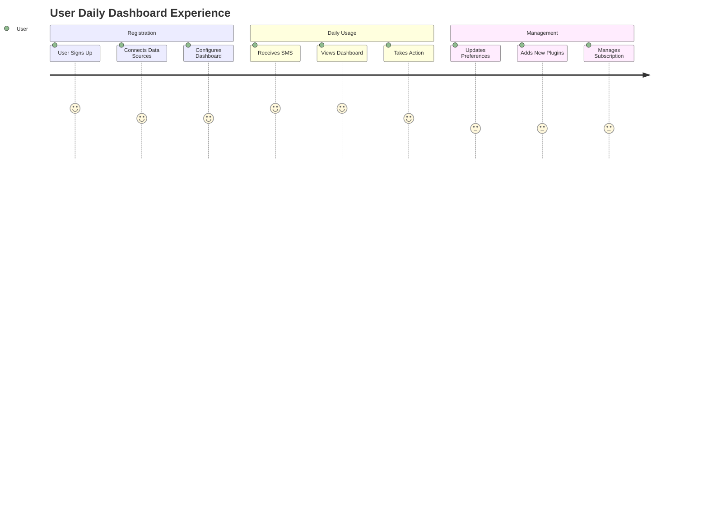

---

## 🏢 Business Model Architecture

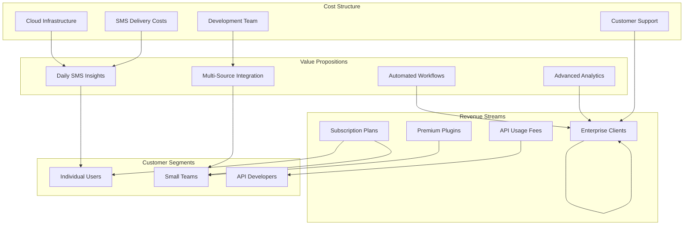

---

## 🔐 Security & Authentication Architecture

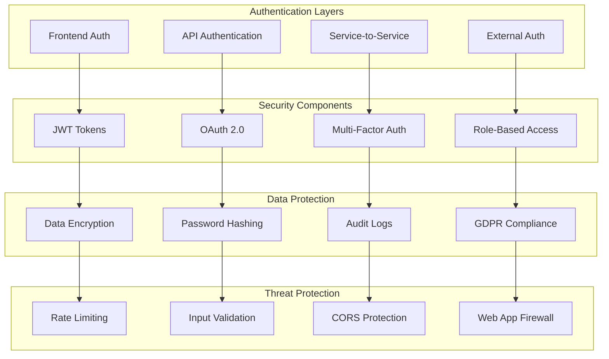

---

## 📊 Data Flow Architecture

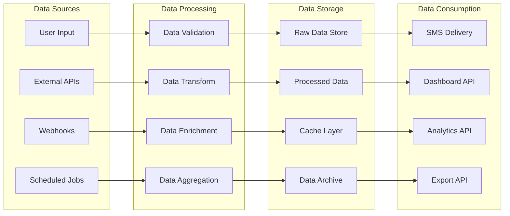

---

## 🚀 Deployment Architecture

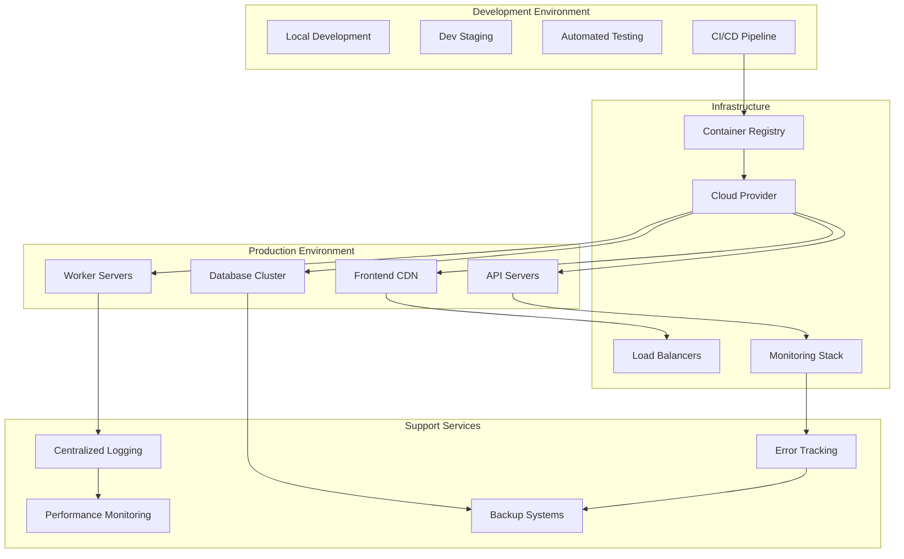

---

## 💰 Technology Stack Architecture

```mermaid
graph TB
    subgraph "Frontend Stack"
        React[React 18]
        TypeScript[TypeScript]
        Tailwind[Tailwind CSS]
        Vite[Vite Build Tool]
    end

    subgraph "Backend Stack"
        NodeJS[Node.js]
        Express[Express.js]
        PostgreSQL[PostgreSQL]
        Redis[Redis]
    end

    subgraph "Infrastructure Stack"
        Docker[Docker Containers]
        Kubernetes[Kubernetes]
        AWS[AWS Services]
        GitHub[GitHub Actions]
    end

    subgraph "Communication Stack"
        REST[REST APIs]
        GraphQL[GraphQL]
        WebSockets[WebSockets]
        MessageQueue[Message Queue]
    end

    subgraph "Monitoring Stack"
        Prometheus[Prometheus]
        Grafana[Grafana]
        Sentry[Sentry]
        LogRocket[LogRocket]
    end

    %% Technology Integration
    React --> TypeScript
    TypeScript --> Tailwind
    Tailwind --> Vite

    NodeJS --> Express
    Express --> PostgreSQL
    PostgreSQL --> Redis

    Docker --> Kubernetes
    Kubernetes --> AWS
    AWS --> GitHub

    REST --> GraphQL
    GraphQL --> WebSockets
    WebSockets --> MessageQueue

    Prometheus --> Grafana
    Grafana --> Sentry
    Sentry --> LogRocket
```

---

## 📈 Scaling Architecture

```mermaid
graph TB
    subgraph "Horizontal Scaling"
        AppServers[App Servers]
        DatabaseReplicas[Database Replicas]
        CacheCluster[Cache Cluster]
        WorkerPool[Worker Pool]
    end

    subgraph "Vertical Scaling"
        CPUScaling[CPU Scaling]
        MemoryScaling[Memory Scaling]
        StorageScaling[Storage Scaling]
        NetworkScaling[Network Scaling]
    end

    subgraph "Auto Scaling"
        TrafficMonitoring[Traffic Monitoring]
        AutoScaling[Auto Scaling Groups]
        LoadBalancing[Load Balancing]
        HealthChecks[Health Checks]
    end

    subgraph "Performance Optimization"
        CDN[Content Delivery]
        Caching[Multi-level Caching]
        DatabaseOptimization[DB Optimization]
        CodeOptimization[Code Optimization]
    end

    %% Scaling Implementation
    AppServers --> DatabaseReplicas
    DatabaseReplicas --> CacheCluster
    CacheCluster --> WorkerPool

    CPUScaling --> MemoryScaling
    MemoryScaling --> StorageScaling
    StorageScaling --> NetworkScaling

    TrafficMonitoring --> AutoScaling
    AutoScaling --> LoadBalancing
    LoadBalancing --> HealthChecks

    CDN --> Caching
    Caching --> DatabaseOptimization
    DatabaseOptimization --> CodeOptimization
```

---

## 🎯 Target User Personas

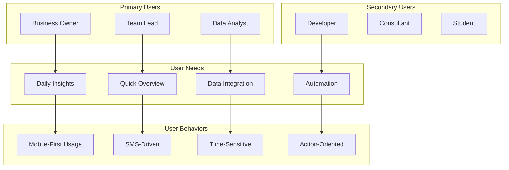

---

## 🔄 Development Workflow Architecture

```mermaid
graph LR
    subgraph "Planning"
        Requirements[Requirements]
        Design[Design]
        Architecture[Architecture]
        Planning[Planning]
    end

    subgraph "Development"
        Coding[Coding]
        Testing[Unit Testing]
        Integration[Integration Testing]
        CodeReview[Code Review]
    end

    subgraph "Deployment"
        Build[Build Process]
        Staging[Staging Deploy]
        Production[Production Deploy]
        Monitoring[Monitoring]
    end

    subgraph "Maintenance"
        BugFixes[Bug Fixes]
        Features[New Features]
        Updates[Updates]
        Support[Support]
    end

    %% Workflow Flow
    Requirements --> Design
    Design --> Architecture
    Architecture --> Planning
    Planning --> Coding

    Coding --> Testing
    Testing --> Integration
    Integration --> CodeReview
    CodeReview --> Build

    Build --> Staging
    Staging --> Production
    Production --> Monitoring

    Monitoring --> BugFixes
    BugFixes --> Features
    Features --> Updates
    Updates --> Support
```

---

## 📊 Analytics & Metrics Architecture

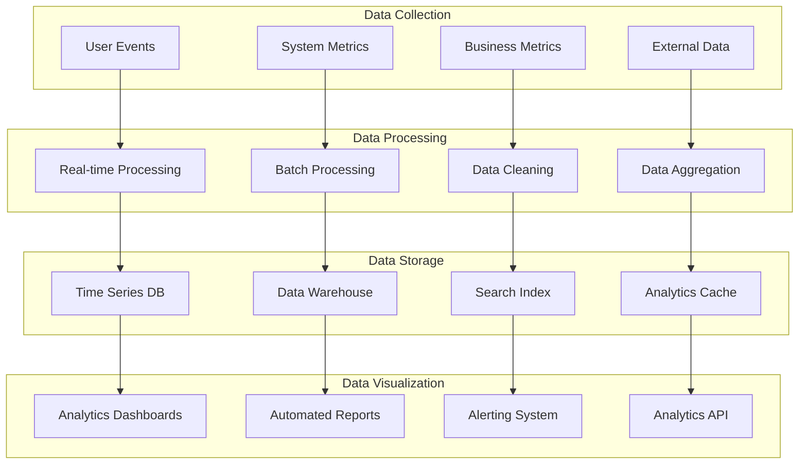

---

## 🎉 Conclusion

This comprehensive architecture blueprint provides a complete view of the CleanConnect system from multiple perspectives:

- **For Developers**: Technical implementation details and system interactions
- **For Investors**: Business model, scalability, and revenue potential
- **For Users**: Value proposition and user journey understanding

The system is designed with enterprise-grade scalability, security, and maintainability in mind, following Zapier-level development standards for a robust multi-tenant SaaS platform.
