# CleanConnect - Complete Architecture Blueprint

## 🎯 Project Overview

CleanConnect is a Zapier-inspired enterprise SaaS platform that delivers personalized daily dashboards via SMS. This document provides comprehensive architectural diagrams for developers, investors, and users to understand the complete system.

---

## 🏗️ High-Level System Architecture

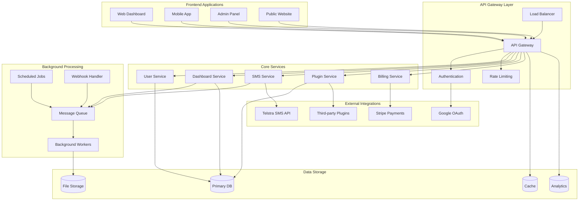

---

## 🔧 Plugin System Architecture

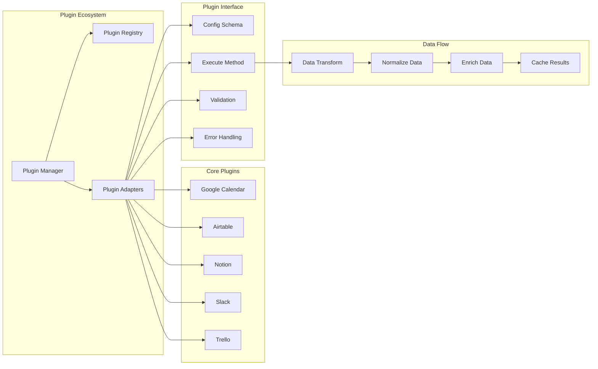

---

## 📱 User Journey Flow

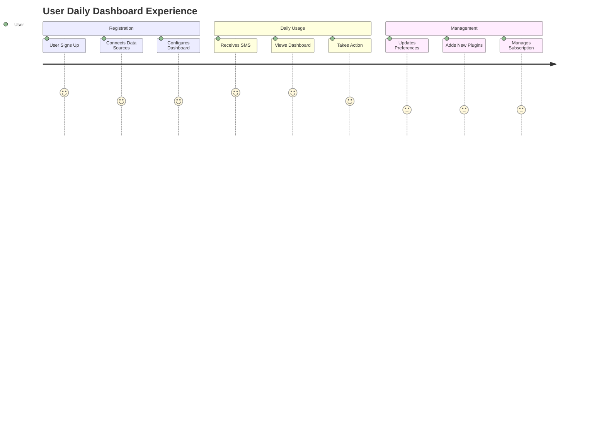

---

## 🏢 Business Model Architecture

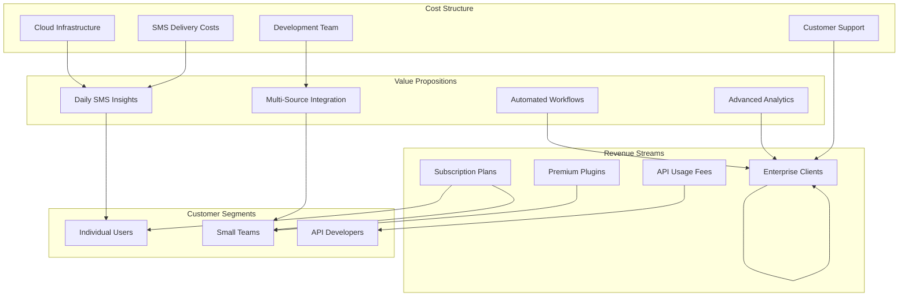

---

## 🔐 Security & Authentication Architecture

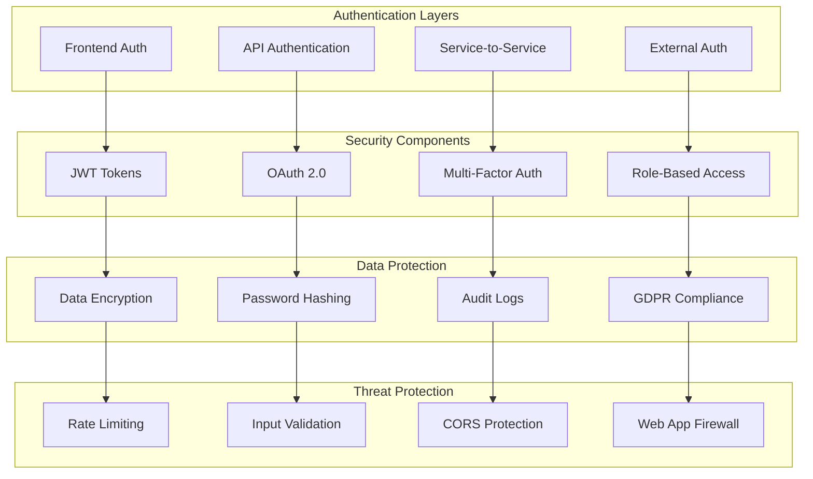

---

## 📊 Data Flow Architecture

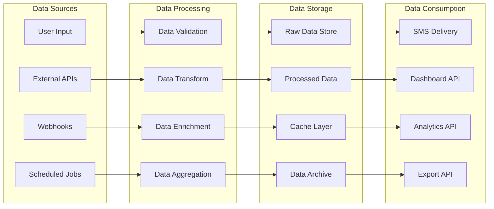

---

## 🚀 Deployment Architecture

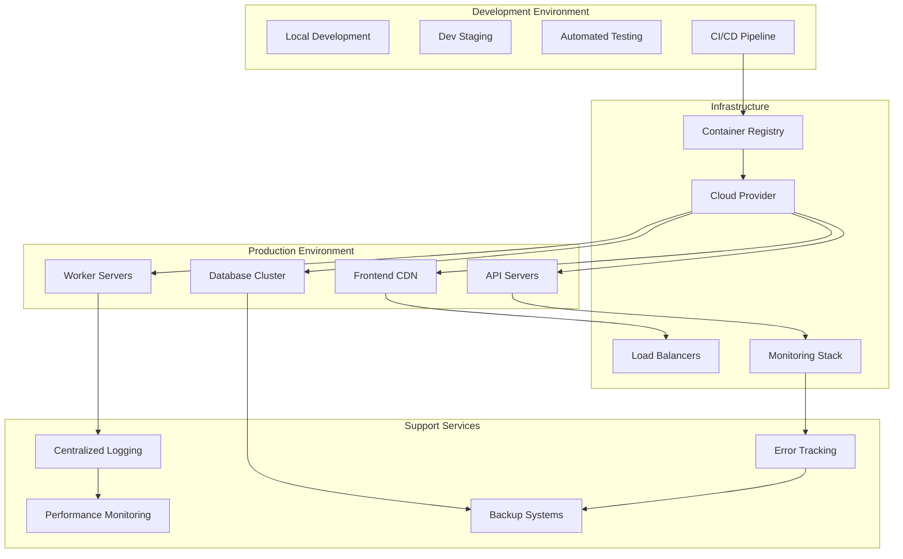

---

## 💰 Technology Stack Architecture

```mermaid
graph TB
    subgraph "Frontend Stack"
        React[React 18]
        TypeScript[TypeScript]
        Tailwind[Tailwind CSS]
        Vite[Vite Build Tool]
    end

    subgraph "Backend Stack"
        NodeJS[Node.js]
        Express[Express.js]
        PostgreSQL[PostgreSQL]
        Redis[Redis]
    end

    subgraph "Infrastructure Stack"
        Docker[Docker Containers]
        Kubernetes[Kubernetes]
        AWS[AWS Services]
        GitHub[GitHub Actions]
    end

    subgraph "Communication Stack"
        REST[REST APIs]
        GraphQL[GraphQL]
        WebSockets[WebSockets]
        MessageQueue[Message Queue]
    end

    subgraph "Monitoring Stack"
        Prometheus[Prometheus]
        Grafana[Grafana]
        Sentry[Sentry]
        LogRocket[LogRocket]
    end

    %% Technology Integration
    React --> TypeScript
    TypeScript --> Tailwind
    Tailwind --> Vite

    NodeJS --> Express
    Express --> PostgreSQL
    PostgreSQL --> Redis

    Docker --> Kubernetes
    Kubernetes --> AWS
    AWS --> GitHub

    REST --> GraphQL
    GraphQL --> WebSockets
    WebSockets --> MessageQueue

    Prometheus --> Grafana
    Grafana --> Sentry
    Sentry --> LogRocket
```

---

## 📈 Scaling Architecture

```mermaid
graph TB
    subgraph "Horizontal Scaling"
        AppServers[App Servers]
        DatabaseReplicas[Database Replicas]
        CacheCluster[Cache Cluster]
        WorkerPool[Worker Pool]
    end

    subgraph "Vertical Scaling"
        CPUScaling[CPU Scaling]
        MemoryScaling[Memory Scaling]
        StorageScaling[Storage Scaling]
        NetworkScaling[Network Scaling]
    end

    subgraph "Auto Scaling"
        TrafficMonitoring[Traffic Monitoring]
        AutoScaling[Auto Scaling Groups]
        LoadBalancing[Load Balancing]
        HealthChecks[Health Checks]
    end

    subgraph "Performance Optimization"
        CDN[Content Delivery]
        Caching[Multi-level Caching]
        DatabaseOptimization[DB Optimization]
        CodeOptimization[Code Optimization]
    end

    %% Scaling Implementation
    AppServers --> DatabaseReplicas
    DatabaseReplicas --> CacheCluster
    CacheCluster --> WorkerPool

    CPUScaling --> MemoryScaling
    MemoryScaling --> StorageScaling
    StorageScaling --> NetworkScaling

    TrafficMonitoring --> AutoScaling
    AutoScaling --> LoadBalancing
    LoadBalancing --> HealthChecks

    CDN --> Caching
    Caching --> DatabaseOptimization
    DatabaseOptimization --> CodeOptimization
```

---

## 🎯 Target User Personas

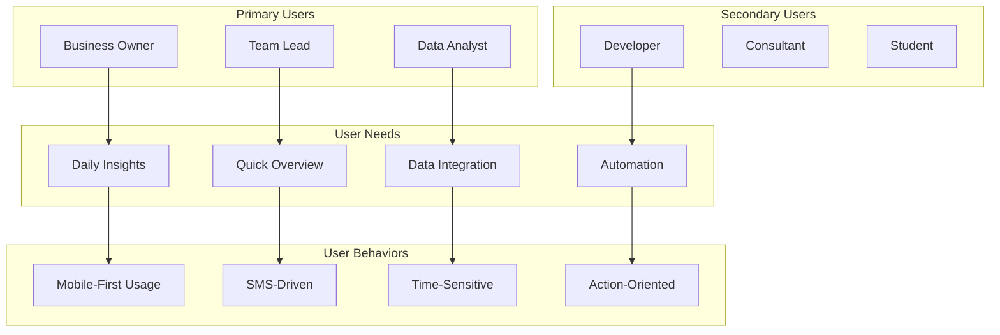

---

## 🔄 Development Workflow Architecture

```mermaid
graph LR
    subgraph "Planning"
        Requirements[Requirements]
        Design[Design]
        Architecture[Architecture]
        Planning[Planning]
    end

    subgraph "Development"
        Coding[Coding]
        Testing[Unit Testing]
        Integration[Integration Testing]
        CodeReview[Code Review]
    end

    subgraph "Deployment"
        Build[Build Process]
        Staging[Staging Deploy]
        Production[Production Deploy]
        Monitoring[Monitoring]
    end

    subgraph "Maintenance"
        BugFixes[Bug Fixes]
        Features[New Features]
        Updates[Updates]
        Support[Support]
    end

    %% Workflow Flow
    Requirements --> Design
    Design --> Architecture
    Architecture --> Planning
    Planning --> Coding

    Coding --> Testing
    Testing --> Integration
    Integration --> CodeReview
    CodeReview --> Build

    Build --> Staging
    Staging --> Production
    Production --> Monitoring

    Monitoring --> BugFixes
    BugFixes --> Features
    Features --> Updates
    Updates --> Support
```

---

## 📊 Analytics & Metrics Architecture

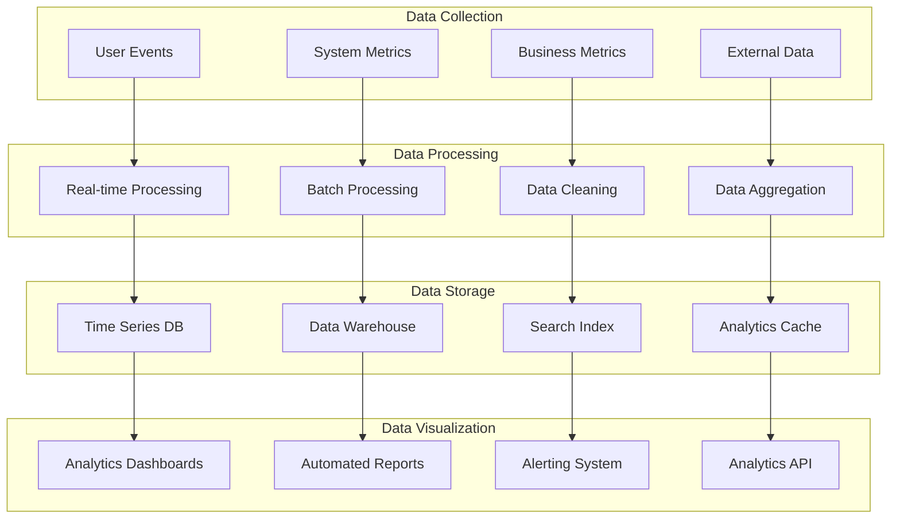

---

## 🎉 Conclusion

This comprehensive architecture blueprint provides a complete view of the CleanConnect system from multiple perspectives:

- **For Developers**: Technical implementation details and system interactions
- **For Investors**: Business model, scalability, and revenue potential
- **For Users**: Value proposition and user journey understanding

The system is designed with enterprise-grade scalability, security, and maintainability in mind, following Zapier-level development standards for a robust multi-tenant SaaS platform.
