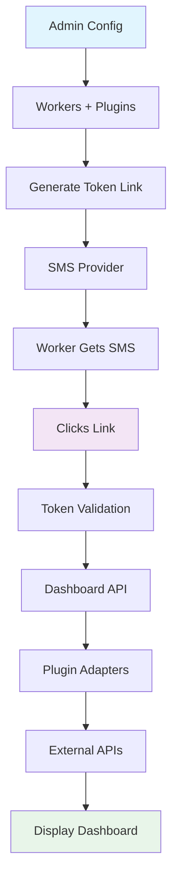

# 📱 Dashboard Link SaaS Platform

> 🚀 The **fastest way** to deliver personalized daily dashboards to your team via SMS.  
> Built for modern businesses—cleaning companies, construction firms, healthcare agencies, and more.  
> **Zero app installs required.** Workers tap a link and see their day.


---

## 🎯 Why Dashboard Link?

- **📱 No apps, no logins**—Workers receive a simple SMS link. Open, view, done.
- **⚡ 2-minute setup**—Connect Google Calendar, Airtable, or enter data manually.
- **� Enterprise-grade security**—Time-limited tokens, organization isolation, encrypted data.
- **💰 Cost-effective SMS**—Australian rates from 2¢/SMS with MobileMessage.
- **📊 Real-time updates**—Dashboards refresh automatically; no page reloads.

**Perfect for:**
- 🧹 Cleaning companies → Daily jobs & locations
- 🏗️ Construction firms → Site assignments & safety briefs
- 🏥 Healthcare agencies → Patient visit schedules
- 📦 Delivery companies → Routes & delivery notes
- 🎓 Schools → Student timetables & events

---

## ✨ What You Get

### 🚀 Core Features
- **SMS Dashboard Delivery** – One-click links sent straight to workers' phones
- **Secure Access Tokens** – Auto-expiring links (1h–24h), single-use protection
- **Plugin System** – Pull data from Google Calendar, Airtable, Notion, or manual entry
- **Multi-tenant by Design** – Each organization is fully isolated (RLS-enabled)
- **Mobile-First UI** – Looks great on any phone, no zooming needed

### 🎨 Admin Dashboard
- **Worker Management** – Add/edit workers with phone validation
- **SMS Logs** – Track delivery status and engagement
- **Plugin Configuration** – OAuth setup for Google, API keys for Airtable/Notion
- **Token Controls** – Generate links with custom expiry times
- **Organization Settings** – Configure company details and preferences

### 📱 Worker Experience
- **Clean, focused view** – Only today's schedule and tasks
- **One-tap refresh** – Always see the latest info
- **Offline-friendly** – Works even with spotty connections
- **No training needed** – Intuitive interface for non-technical users

---

## 🏗️ Architecture at a Glance



### 🛠️ Tech Stack

- **Frontend**: Vite + React 18 + TanStack Query + Tailwind + Zustand
- **Backend**: Hono.js + Supabase (PostgreSQL + Auth)
- **SMS**: MobileMessage.com.au (Australia)
- **Tooling**: Turborepo + pnpm + TypeScript + Vitest

---

## � Quick Start (5 minutes)

### Prerequisites
- Node.js 18+
- pnpm 9+
- Supabase account (free tier works)
- MobileMessage.com.au account (for SMS)

###  Manual Setup

#### 1️⃣ Clone & Install
```bash
git clone https://github.com/SlySlayer32/dashboard-link-saas.git
cd dashboard-link-saas
pnpm install
```

#### 2️⃣ Environment Variables
```bash
cp .env.example .env
```

Edit `.env` with your keys:
```env
# App
APP_URL=http://localhost:5173
API_URL=http://localhost:3000

# Supabase (get from https://supabase.com/dashboard/project/_/settings/api)
SUPABASE_URL=https://your-project.supabase.co
SUPABASE_ANON_KEY=your-anon-key
SUPABASE_SERVICE_KEY=your-service-key

# MobileMessage.com.au SMS
MOBILEMESSAGE_USERNAME=your-username
MOBILEMESSAGE_PASSWORD=your-password
MOBILEMESSAGE_SENDER_ID=DashLink

# Optional plugins
GOOGLE_CLIENT_ID=your-client-id
GOOGLE_CLIENT_SECRET=your-client-secret
AIRTABLE_API_KEY=your-api-key
NOTION_INTEGRATION_SECRET=your-integration-secret
```

#### 3️⃣ Database Setup
```bash
# Apply migrations to your online Supabase project
npx supabase link --project-ref your-project-ref
npx supabase db push

# (Optional) Seed sample data
npx supabase db reset
```

#### 4️⃣ Start Everything
```bash
pnpm dev
```

🎉 **Your apps are live:**
- Admin: http://localhost:5173
- Worker: http://localhost:5174
- API: http://localhost:3000

---

## 🧪 Testing & Quality

```bash
# Run all tests
pnpm test

# Run with coverage
pnpm test:coverage

# Lint and format
pnpm lint
pnpm format

# Type check (build)
pnpm build
```

**Test coverage targets:**
- API routes: 90%+
- React components: 85%+
- Utils/validators: 95%+

---

## 🔌 Plugin System

Connect your existing tools in minutes.

| Plugin | What it does | Setup time |
|--------|--------------|------------|
| **Manual Entry** | Type schedules/tasks directly | 30s |
| **Google Calendar** | Sync events from calendars | 2m |
| **Airtable** | Pull from any base | 2m |
| **Notion** | Fetch from databases | 2m |

### Create Your Own Plugin

```typescript
import { BaseAdapter } from '@dashboard-link/plugins';

export class MyAdapter extends BaseAdapter {
  id = 'my-plugin';
  name = 'My Custom Plugin';
  version = '1.0.0';

  async getTodaySchedule(workerId: string, config: any) {
    // Fetch schedule from your API
    return [];
  }

  async getTodayTasks(workerId: string, config: any) {
    // Fetch tasks from your API
    return [];
  }
}
```

---

## 📱 SMS Integration Details

We use **MobileMessage.com.au** for unbeatable Australian rates:

| Feature | Detail |
|---------|--------|
| **Cost** | 2¢/SMS intro, 3¢ ongoing |
| **Fees** | None |
| **Number** | Free virtual number for replies |
| **Support** | Australian-based |

**Example SMS to a worker:**
```
Hi Sarah! Your daily dashboard is ready: https://dash.yourco.com/dashboard/7x9k2m
```

---

## 🚀 Deploy to Production

### Vercel (Recommended)

```bash
# Install Vercel CLI
npm i -g vercel

# Deploy
vercel --prod

# Custom domain
vercel --prod --domains dashboard.yourcompany.com
```

### Docker

```bash
# Build
docker build -t dashboard-link .

# Run with compose
docker-compose up -d
```

### Environment Checklist for Production

- [ ] Supabase URL & keys
- [ ] MobileMessage credentials
- [ ] Plugin API keys (if used)
- [ ] CORS allowed origins
- [ ] Custom domain (optional)

---

## 📚 Documentation

- **[Architecture](./docs/ARCHITECTURE.md)** – System design
- **[Development Guide](./docs/DEVELOPMENT_ENVIRONMENT.md)** – Local setup
- **[Plugin Development](./docs/PLUGIN_DEVELOPMENT.md)** – Build adapters
- **[API Reference](./docs/API.md)** – Endpoints & examples
- **[Deployment](./docs/DEPLOYMENT.md)** – Production guide

---

## 🤝 Contributing

We love contributions! Here's how:

1. Fork this repo
2. Create a feature branch: `git checkout -b feature/amazing`
3. Make changes and test: `pnpm test`
4. Commit: `git commit -m 'Add amazing feature'`
5. Push: `git push origin feature/amazing`
6. Open a Pull Request

Read our [Contributing Guide](./CONTRIBUTING.md) for details.

---

## 📄 License

MIT License — see [LICENSE](LICENSE) for full details.

---

## 🙏 Made Possible By

- [Hono.js](https://hono.dev) – Blazing-fast web framework
- [Supabase](https://supabase.com) – Backend-as-a-Service
- [Vite](https://vitejs.dev) – Instant dev server
- [MobileMessage.com.au](https://mobilemessage.com.au) – SMS delivery
- [Tailwind CSS](https://tailwindcss.com) – Utility-first styling

---

## 📞 Need Help?

- 📧 Email: support@dashboardlink.com
- 💬 Discord: [Join our community](https://discord.gg/dashboardlink)
- 🐛 Report issues: [GitHub Issues](https://github.com/SlySlayer32/dashboard-link-saas/issues)
- 📖 Docs: [docs.dashboardlink.com](https://docs.dashboardlink.com)

---

<div align="center">

**⭐ Star us if Dashboard Link saves you time!**

Made with ❤️ in Australia 🇦🇺

[⬆ Back to top](#-dashboard-link-saas-platform)

</div>
