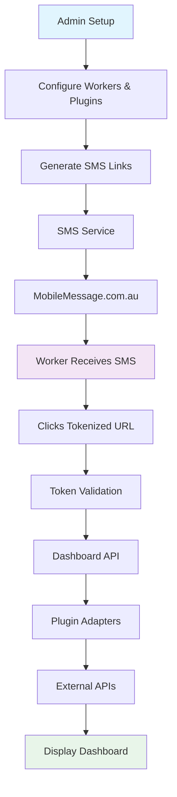

# 📱 Dashboard Link SaaS Platform

> 🚀 A modern SaaS platform for delivering personalized daily dashboards to workers via SMS. Built with Vite, React, Hono.js, and Supabase.


## 📸 Live Demo

<!-- Add your demo GIF or screenshot here -->


**👉 [View Live Demo](https://dashboard-link-demo.vercel.app)**

---

## 📋 Overview

Dashboard Link allows organizations to create and deliver personalized daily dashboards for their people (workers, contractors, staff) via SMS. Admins configure dashboard widgets powered by plugins that pull data from external systems like Google Calendar, Airtable, or Notion.

### 🎯 Perfect for:
- 🧹 **Cleaning companies** → Send cleaners their daily jobs/locations
- 🏗️ **Construction firms** → Send workers their site assignments
- 🏥 **Healthcare agencies** → Send carers their patient visit schedules
- 📦 **Delivery companies** → Send drivers their daily routes
- 🎓 **Educational institutions** → Send students their daily schedules

---

## ✨ Key Features

### 🚀 Core Functionality
- **📱 SMS Delivery** - Workers receive dashboard links via SMS (Australian provider: MobileMessage.com.au)
- **🔒 Secure Tokens** - Time-limited access tokens (1hr-1day expiry) with single-use security
- **🔌 Plugin System** - Extensible adapter system for external data sources
- **⚡ Real-time Updates** - Webhook support for push notifications
- **🏢 Multi-tenant** - Full organization isolation with Row Level Security
- **📊 Mobile-first** - Responsive dashboards optimized for mobile devices

### 🎨 Admin Dashboard
- **👥 Worker Management** - CRUD operations for workers with phone validation
- **📈 Dashboard Analytics** - View engagement metrics and usage statistics
- **🔧 Plugin Configuration** - Easy setup for Google Calendar, Airtable, Notion
- **💬 SMS Logs** - Track message delivery and engagement
- **⏰ Token Management** - Generate and manage access tokens with custom expiry
- **🏢 Organization Settings** - Configure company details and preferences

### 📱 Worker Experience
- **🎯 Clean Interface** - Minimal, distraction-free dashboard view
- **📅 Today's Schedule** - View upcoming jobs and appointments
- **✅ Task Management** - Check off completed tasks
- **🔄 Auto-refresh** - Real-time updates without page reload
- **⏱️ Time Tracking** - See start times and durations

---

## 🏗️ Architecture



### 🛠️ Tech Stack

#### Frontend
- **[Vite](https://vitejs.dev/)** ⚡ - Lightning-fast build tool
- **[React 18](https://reactjs.org/)** ⚛️ - UI library with hooks
- **[TanStack Query](https://tanstack.com/query)** 🔄 - Data fetching & caching
- **[Tailwind CSS](https://tailwindcss.com/)** 🎨 - Utility-first CSS
- **[Zustand](https://github.com/pmndrs/zustand)** 📦 - Lightweight state management
- **[React Hook Form](https://react-hook-form.com/)** 📝 - Form handling
- **[Zod](https://zod.dev/)** ✅ - Schema validation

#### Backend
- **[Hono.js](https://hono.dev/)** 🚀 - Ultra-fast web framework (edge-ready)
- **[Supabase](https://supabase.com/)** 🗄️ - PostgreSQL database + Auth + Storage
- **[MobileMessage.com.au](https://mobilemessage.com.au/)** 📧 - Australian SMS provider (2-3¢/SMS)

#### Development Tools
- **[Turborepo](https://turbo.build/)** 🏗️ - High-performance build system
- **[pnpm](https://pnpm.io/)** 📦 - Fast, disk space efficient package manager
- **[TypeScript](https://www.typescriptlang.org/)** 🔷 - Type-safe development
- **[Vitest](https://vitest.dev/)** 🧪 - Unit testing framework
- **[ESLint](https://eslint.org/)** 🔍 - Code linting
- **[Prettier](https://prettier.io/)** 💅 - Code formatting

---

## 📸 UI Showcase

### Admin Dashboard
<table>
  <tr>
    <td width="50%">
      
      <p align="center"><strong>Dashboard Overview</strong></p>
    </td>
    <td width="50%">
      
      <p align="center"><strong>Worker Management</strong></p>
    </td>
  </tr>
  <tr>
    <td width="50%">
      
      <p align="center"><strong>Plugin Configuration</strong></p>
    </td>
    <td width="50%">
      
      <p align="center"><strong>SMS Delivery Logs</strong></p>
    </td>
  </tr>
</table>

### Worker Mobile Dashboard
<table>
  <tr>
    <td width="50%">
      
      <p align="center"><strong>Mobile Dashboard View</strong></p>
    </td>
    <td width="50%">
      
      <p align="center"><strong>Token Expired Page</strong></p>
    </td>
  </tr>
</table>

---

## 🚀 Quick Start

### Prerequisites

- **Node.js** 18+ 
- **pnpm** 9+
- **Supabase account** (free tier available)
- **MobileMessage.com.au account** (for SMS)

### One-Click Setup

```bash
# Clone and setup in one command
bash <(curl -s https://raw.githubusercontent.com/SlySlayer32/dashboard-link-saas/main/scripts/setup.sh)
```

### Manual Installation

1. **Clone the repository**
   ```bash
   git clone https://github.com/SlySlayer32/dashboard-link-saas.git
   cd dashboard-link-saas
   ```

2. **Install dependencies**
   ```bash
   pnpm install
   ```

3. **Set up environment variables**
   ```bash
   cp .env.example .env
   # Edit .env with your credentials
   ```

4. **Set up Supabase**
   ```bash
   # Run migrations
   pnpm db:migrate
   # Seed with sample data (optional)
   pnpm db:seed
   ```

5. **Start development servers**
   ```bash
   pnpm dev
   ```

   🎉 Your apps are now running:
   - Admin app: http://localhost:5173
   - Worker app: http://localhost:5174
   - API server: http://localhost:3000

---

## 🔌 Plugin System

Dashboard Link uses a plugin adapter system to fetch data from external sources:

### Built-in Plugins

| Plugin | Description | Status |
|--------|-------------|--------|
| **Manual Entry** | Direct data entry (no external API) | ✅ Available |
| **Google Calendar** | Sync schedule from Google Calendar | ✅ Available |
| **Airtable** | Pull data from Airtable bases | ✅ Available |
| **Notion** | Fetch from Notion databases | ✅ Available |

### Creating Custom Plugins

```typescript
import { BaseAdapter } from '@dashboard-link/plugins';

export class MyCustomAdapter extends BaseAdapter {
  id = 'my-custom-plugin';
  name = 'My Custom Plugin';
  description = 'Description here';
  version = '1.0.0';

  async getTodaySchedule(workerId: string, config: any) {
    // Fetch and return schedule items
    return [];
  }

  async getTodayTasks(workerId: string, config: any) {
    // Fetch and return task items
    return [];
  }
}
```

---

## 📱 SMS Integration

We use **MobileMessage.com.au** for SMS delivery:

| Feature | Details |
|---------|---------|
| **Pricing** | 2¢/SMS intro, 3¢ ongoing (vs Twilio AU at 5.15¢) |
| **Monthly Fees** | None |
| **Credits** | Never expire |
| **Virtual Number** | Free for 2-way SMS |
| **Coverage** | Australian-based with local support |

Example SMS sent to workers:
```
Hi John! Your daily dashboard is ready: https://app.dashlink.com/dashboard/abc123xyz
```

---

## 🧪 Testing

```bash
# Run tests across all packages
pnpm test

# Run tests with coverage
pnpm test:coverage

# Lint code
pnpm lint

# Type check
pnpm build

# Format code
pnpm format
```

---

## 📚 Documentation

- **[📖 Architecture Guide](./docs/ARCHITECTURE.md)** - System design and architecture
- **[🔧 Development Guide](./docs/DEVELOPMENT_ENVIRONMENT.md)** - Development setup
- **[🔌 Plugin Development](./docs/PLUGIN_DEVELOPMENT.md)** - Create custom plugins
- **[📊 API Documentation](./docs/API.md)** - API endpoints and usage
- **[🚀 Deployment Guide](./docs/DEPLOYMENT.md)** - Production deployment

---

## 🚢 Deployment

### Vercel (Recommended)

```bash
# Deploy frontend and API
vercel --prod

# Deploy with custom domain
vercel --prod --domains dashboard.yourcompany.com
```

### Docker

```bash
# Build Docker image
docker build -t dashboard-link .

# Run with Docker Compose
docker-compose up -d
```

### Environment Variables

| Variable | Description | Required |
|----------|-------------|----------|
| `SUPABASE_URL` | Supabase project URL | ✅ |
| `SUPABASE_ANON_KEY` | Supabase anonymous key | ✅ |
| `SUPABASE_SERVICE_KEY` | Supabase service key | ✅ |
| `MOBILEMESSAGE_USERNAME` | SMS provider username | ✅ |
| `MOBILEMESSAGE_PASSWORD` | SMS provider password | ✅ |
| `GOOGLE_CLIENT_ID` | Google Calendar OAuth | ❌ |
| `AIRTABLE_API_KEY` | Airtable API key | ❌ |
| `NOTION_INTEGRATION_SECRET` | Notion integration secret | ❌ |

---

## 🤝 Contributing

We welcome contributions! Please see our [Contributing Guide](./CONTRIBUTING.md) for details.

### Quick Start for Contributors

1. Fork the repository
2. Create your feature branch (`git checkout -b feature/amazing-feature`)
3. Make your changes
4. Run tests (`pnpm test`)
5. Commit your changes (`git commit -m 'Add amazing feature'`)
6. Push to the branch (`git push origin feature/amazing-feature`)
7. Open a Pull Request

---

## 📄 License

This project is licensed under the MIT License - see the [LICENSE](LICENSE) file for details.

---

## 🙏 Acknowledgments

- Built with ❤️ using [Hono.js](https://hono.dev/)
- Powered by [Supabase](https://supabase.com)
- UI components inspired by [shadcn/ui](https://ui.shadcn.com/)
- SMS delivery by [MobileMessage.com.au](https://mobilemessage.com.au)
- Icons by [Lucide](https://lucide.dev/)

---

## 📞 Support

- 📧 Email: support@dashboardlink.com
- 💬 Discord: [Join our community](https://discord.gg/dashboardlink)
- 🐛 Issues: [Open an issue on GitHub](https://github.com/SlySlayer32/dashboard-link-saas/issues)
- 📖 Docs: [Full documentation](https://docs.dashboardlink.com)

---

<div align="center">

**⭐ Star this repo if it helped you!**

Made with ❤️ in Australia 🇦🇺

[⬆ Back to top](#-dashboard-link-saas-platform)

</div>
