# CleanConnect Project Architecture & Operations

This document contains comprehensive Mermaid diagrams that visualize how the CleanConnect project operates and is set up.

## Table of Contents
1. [System Architecture Overview](#system-architecture-overview)
2. [Monorepo Structure](#monorepo-structure)
3. [Data Flow Diagrams](#data-flow-diagrams)
4. [Authentication Flow](#authentication-flow)
5. [Plugin Architecture](#plugin-architecture)
6. [Database Schema](#database-schema)
7. [Deployment Architecture](#deployment-architecture)
8. [Development Workflow](#development-workflow)

---

## System Architecture Overview

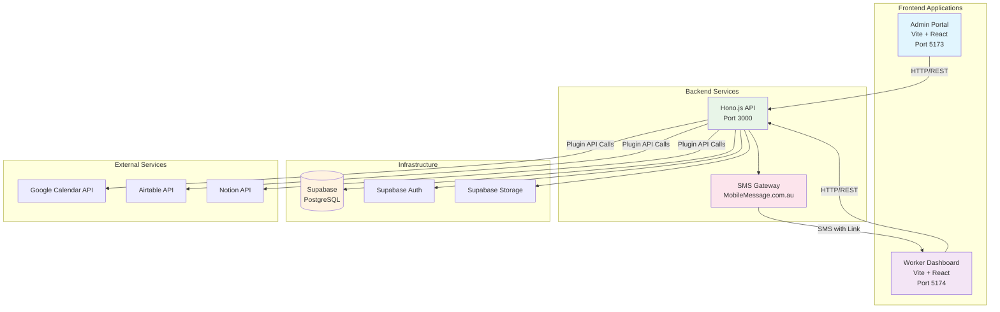

---

## Monorepo Structure

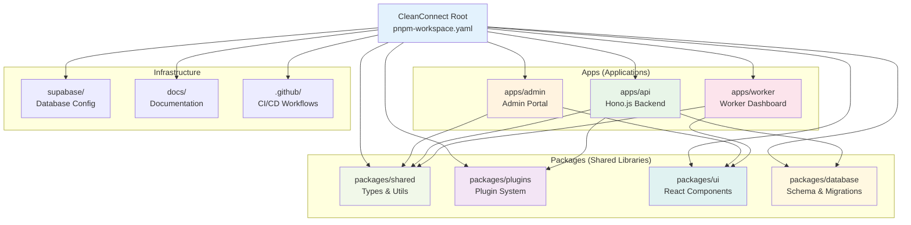

---

## Data Flow Diagrams

### 1. Admin Creates Dashboard Link

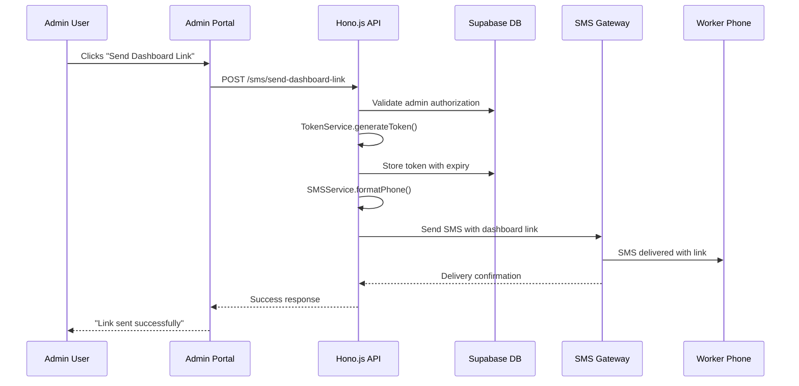

### 2. Worker Accesses Dashboard

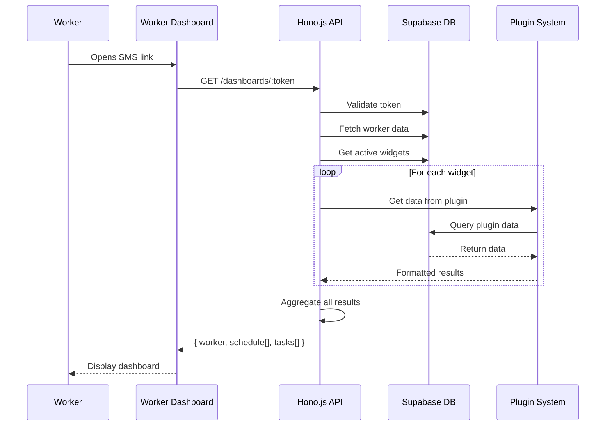

---

## Authentication Flow

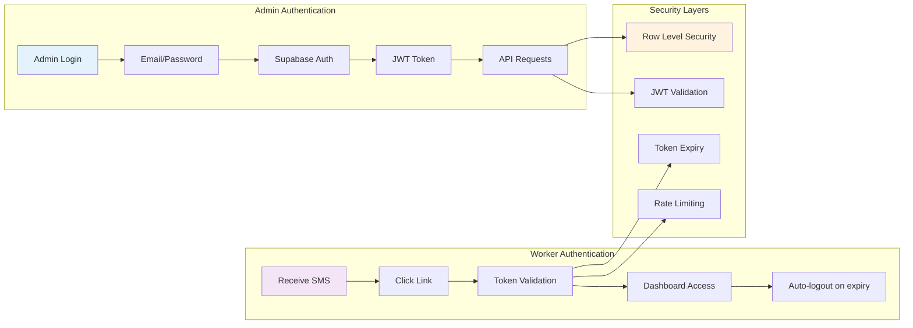

---

## Plugin Architecture

```mermaid
graph TB
    subgraph "Plugin System"
        REGISTRY[Plugin Registry<br/>Singleton]
        MANAGER[Plugin Manager<br/>Orchestrator]
    end
    
    subgraph "Plugin Adapters"
        BASE[BaseAdapter<br/>Abstract Class]
        MANUAL[ManualAdapter]
        GOOGLE[GoogleCalendarAdapter]
        AIRTABLE[AirtableAdapter]
        NOTION[NotionAdapter]
        CUSTOM[CustomAdapter]
    end
    
    subgraph "Plugin Interface"
        INTERFACE[getTodaySchedule()<br/>getTodayTasks()<br/>validateConfig()<br/>handleWebhook()]
    end
    
    REGISTRY --> MANUAL
    REGISTRY --> GOOGLE
    REGISTRY --> AIRTABLE
    REGISTRY --> NOTION
    REGISTRY --> CUSTOM
    
    BASE --> MANUAL
    BASE --> GOOGLE
    BASE --> AIRTABLE
    BASE --> NOTION
    BASE --> CUSTOM
    
    MANUAL --> INTERFACE
    GOOGLE --> INTERFACE
    AIRTABLE --> INTERFACE
    NOTION --> INTERFACE
    CUSTOM --> INTERFACE
    
    MANAGER --> REGISTRY
    
    style REGISTRY fill:#e8f5e8
    style MANAGER fill:#e1f5fe
    style BASE fill:#fff3e0
    style INTERFACE fill:#f3e5f5
```

---

## Database Schema

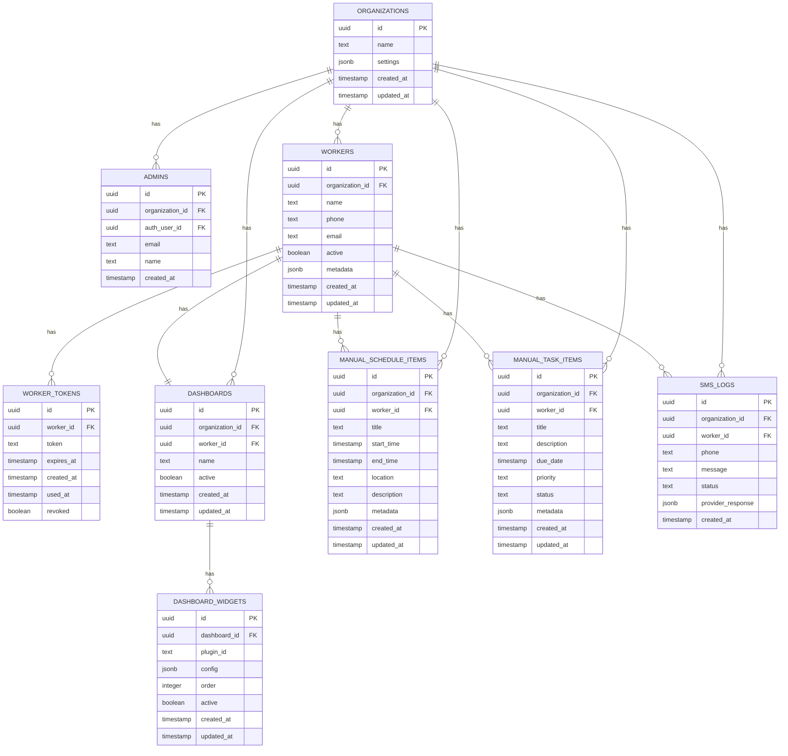

---

## Deployment Architecture

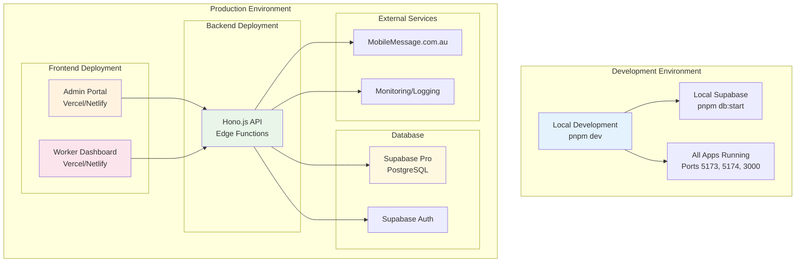

---

## Development Workflow

```mermaid
gitgraph
    commit id: "Initial Setup"
    branch feature/new-plugin
    checkout feature/new-plugin
    commit id: "Add plugin interface"
    commit id: "Implement adapter"
    commit id: "Add tests"
    checkout main
    merge feature/new-plugin
    commit id: "Release plugin"
    branch hotfix/security-fix
    checkout hotfix/security-fix
    commit id: "Fix token validation"
    checkout main
    merge hotfix/security-fix tag: "v1.0.1"
    commit id: "Documentation update"
```

---

## Component Interaction Flow

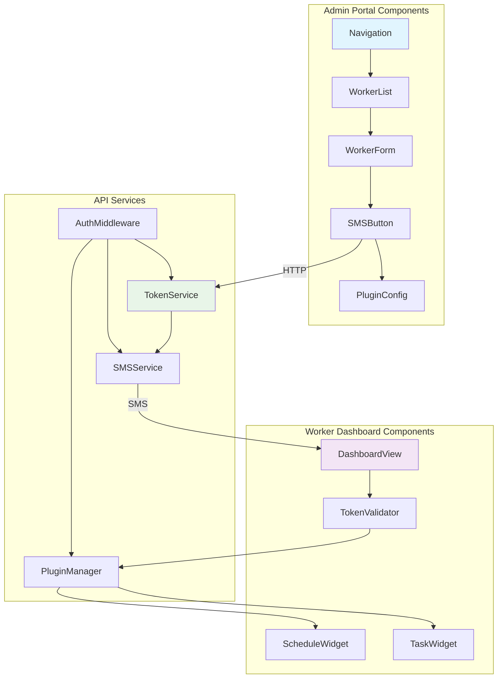

---

## Testing Architecture

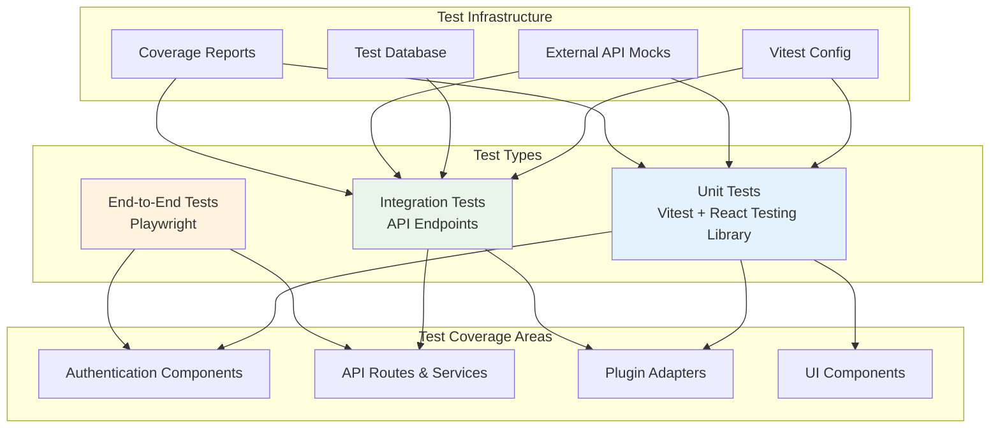

---

## Performance & Scaling Architecture

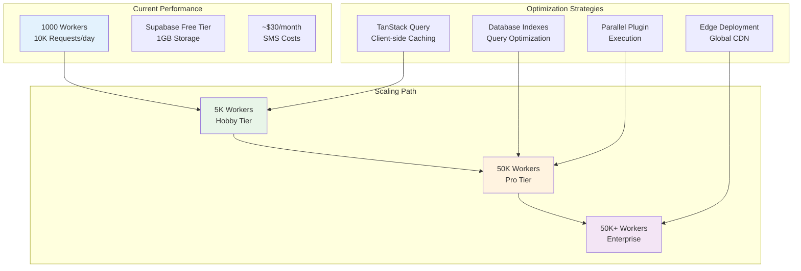

---

## Security Architecture

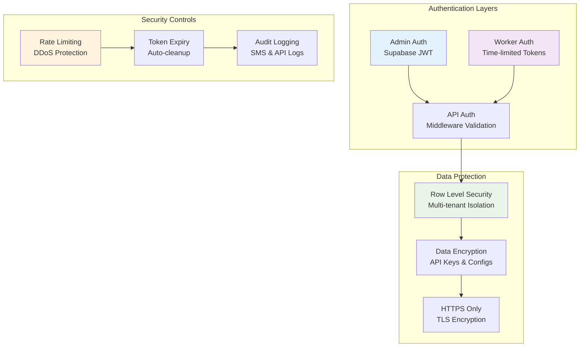

---

## Future Enhancement Roadmap

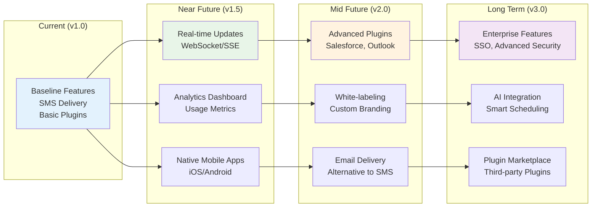

---

## Key Insights & Recommendations

### ✅ **Well-Designed Aspects**
1. **Clean Monorepo Structure** - Clear separation between apps and packages
2. **Plugin Architecture** - Extensible system with standardized interfaces
3. **Multi-tenant Security** - Row Level Security for data isolation
4. **Mobile-First Design** - Worker dashboard optimized for mobile
5. **Token-Based Access** - Secure, passwordless worker authentication

### 🔧 **Potential Improvements**
1. **Real-time Updates** - Add WebSocket/SSE for live dashboard updates
2. **Caching Layer** - Redis for plugin data and API responses
3. **Monitoring** - Comprehensive logging and error tracking
4. **Testing Coverage** - Expand E2E tests for critical user flows
5. **Documentation** - API documentation and plugin development guides

### 🚀 **Scaling Considerations**
1. **Database Optimization** - Proper indexing and query optimization
2. **Edge Deployment** - Deploy API to edge functions for global performance
3. **Load Balancing** - Multiple API instances for high availability
4. **CDN Integration** - Static assets delivery optimization
5. **Background Jobs** - Cron jobs for token cleanup and data processing

These diagrams provide a comprehensive view of the CleanConnect project's architecture, helping developers understand the system's design, data flows, and operational patterns.
