# Architecture Diagrams - CleanConnect

> **98% open. Zero downloads.**

Visual documentation of CleanConnect's system architecture using Mermaid diagrams.

---

## 📊 Table of Contents

1. [Complete User Flow](#complete-user-flow)
2. [Database Schema](#database-schema)
3. [API Architecture](#api-architecture)
4. [Plugin System](#plugin-system)
5. [Authentication Flow](#authentication-flow)
6. [Multi-Tenant Data Isolation](#multi-tenant-data-isolation)

---

## 🔄 Complete User Flow

This diagram shows the complete flow from admin setup to worker viewing their dashboard.


### Key Points

- **Steps 1-2:** Admin sets up workers and triggers SMS
- **Step 3:** Worker receives and opens link on mobile
- **Steps 4-5:** Backend validates token and fetches data from plugins
- **Step 6:** External systems provide data via their APIs
- **Step 7:** Worker sees personalized dashboard
- **Webhooks:** Real-time updates push from external systems (future feature)

---

## 🗄️ Database Schema

Entity relationship diagram showing all tables and their relationships.


### Key Relationships

- **Multi-tenant:** All tables have `organization_id` for complete isolation
- **One dashboard per worker:** Each worker has exactly one dashboard
- **Many widgets per dashboard:** Dashboards can have multiple plugins configured
- **Tokens for access:** Workers receive tokens to access their dashboard
- **Audit trail:** SMS logs track all messages sent

---

## 🚀 API Architecture

How the API server is structured and how requests flow through it.

```mermaid
graph TB
    subgraph Client["Client Applications"]
        AdminApp[Admin Portal<br/>React + Vite]
        WorkerApp[Worker Dashboard<br/>React + Vite]
    end
    
    subgraph API["Hono.js API Server"]
        Gateway[API Gateway<br/>Port 3000]
        
        subgraph Middleware["Middleware Layer"]
            Auth[Auth Middleware<br/>JWT Validation]
            RateLimit[Rate Limiter<br/>100 req/min]
            Error[Error Handler]
        end
        
        subgraph Routes["Route Handlers"]
            AuthRoutes[/auth<br/>Login, Signup]
            WorkerRoutes[/workers<br/>CRUD]
            OrgRoutes[/organizations<br/>Settings]
            SMSRoutes[/sms<br/>Send Links]
            DashRoutes[/dashboards/:token<br/>Public]
            WebhookRoutes[/webhooks/:plugin<br/>Callbacks]
        end
        
        subgraph Services["Business Logic"]
            TokenService[Token Service<br/>Generate/Validate]
            SMSService[SMS Service<br/>MobileMessage API]
            PluginManager[Plugin Manager<br/>Orchestrate Data]
        end
    end
    
    subgraph Database["Supabase"]
        PostgreSQL[(PostgreSQL<br/>with RLS)]
        SupabaseAuth[Supabase Auth<br/>JWT Tokens]
    end
    
    subgraph External["External Services"]
        MobileMessage[MobileMessage.com.au<br/>SMS Gateway]
        Plugins[Plugin APIs<br/>Google, Airtable, etc.]
    end
    
    AdminApp --> Gateway
    WorkerApp --> Gateway
    Gateway --> Middleware
    Middleware --> Routes
    Routes --> Services
    Services --> PostgreSQL
    Services --> SupabaseAuth
    Services --> MobileMessage
    Services --> Plugins
    
    Auth -.-> SupabaseAuth
    SMSService -.-> MobileMessage
    PluginManager -.-> Plugins
```

### API Layers

1. **Gateway:** Entry point for all requests
2. **Middleware:** Auth, rate limiting, error handling
3. **Routes:** HTTP endpoint handlers
4. **Services:** Business logic (token generation, SMS, plugins)
5. **Database:** Supabase PostgreSQL with RLS
6. **External:** Third-party services (SMS, plugin APIs)

---

## 🔌 Plugin System

How the plugin architecture works with adapters and external APIs.


### Plugin Flow

1. **Admin configures** plugin in dashboard (API keys, settings)
2. **Config stored** in `dashboard_widgets` table (JSONB)
3. **Worker opens dashboard** → API validates token
4. **Plugin Manager** loads configured plugins from registry
5. **Each adapter** fetches data from its external API
6. **Results aggregated** and sorted
7. **Returned to worker** dashboard

### Adding New Plugins

To add a new plugin:
1. Extend `BaseAdapter` class
2. Implement required methods (`getTodaySchedule`, `getTodayTasks`)
3. Register in `PluginRegistry`
4. Add configuration UI in admin portal

---

## 🔐 Authentication Flow

How admin and worker authentication works differently.

```mermaid
sequenceDiagram
    participant Admin as Admin User
    participant AdminApp as Admin Portal
    participant API as Hono.js API
    participant SupabaseAuth as Supabase Auth
    participant DB as PostgreSQL
    
    rect rgb(200, 220, 240)
        Note over Admin,DB: Admin Authentication (Traditional)
        Admin->>AdminApp: Enter email/password
        AdminApp->>SupabaseAuth: Login request
        SupabaseAuth->>SupabaseAuth: Validate credentials
        SupabaseAuth-->>AdminApp: JWT token
        AdminApp->>AdminApp: Store token in localStorage
        AdminApp->>API: Request with Authorization header
        API->>SupabaseAuth: Validate JWT
        SupabaseAuth-->>API: User ID + org_id
        API->>DB: Query with org_id filter
        DB-->>API: Data (RLS enforced)
        API-->>AdminApp: Protected data
    end
    
    participant Worker as Worker
    participant SMS as SMS Gateway
    participant WorkerApp as Worker Dashboard
    
    rect rgb(220, 240, 200)
        Note over Admin,WorkerApp: Worker Authentication (Token-based)
        Admin->>API: Send dashboard link to worker
        API->>API: Generate secure token (256-bit)
        API->>DB: Store token with expiry
        API->>SMS: Send SMS with tokenized URL
        SMS->>Worker: SMS delivered
        Worker->>WorkerApp: Click link (opens /dashboard/abc123)
        WorkerApp->>API: GET /dashboards/abc123
        API->>DB: Validate token (expiry, revoked, etc.)
        DB-->>API: Token valid → worker_id
        API->>DB: Fetch worker data + dashboard
        DB-->>API: Worker schedule + tasks
        API-->>WorkerApp: Dashboard data (no auth needed after token)
        WorkerApp->>WorkerApp: Display dashboard
    end
```



### Two Authentication Patterns

**Admin Authentication:**
- Traditional email/password via Supabase Auth
- JWT tokens with organization context
- Long-lived sessions (until logout)
- Full CRUD permissions for their org

**Worker Authentication:**
- Token-based (no password required)
- Time-limited (1hr - 1day configurable)
- Single or multi-use (configurable)
- Read-only access to personal dashboard

---

## 🏢 Multi-Tenant Data Isolation

How Row Level Security (RLS) ensures complete data isolation between organizations.


### How RLS Works

1. **Helper Function:** `get_user_organization_id()` returns org ID from JWT
2. **Policies:** Every table has RLS policy filtering by org ID
3. **Automatic:** Developers can't accidentally query wrong org
4. **Secure:** Even with SQL injection, can't access other org's data

### Example Policy

```sql
CREATE POLICY worker_policy ON workers
  FOR ALL
  USING (organization_id = get_user_organization_id());
```

This ensures:
- Alice (CleanCo) only sees Bob and Carol
- John (BuildPro) only sees Dave and Eve
- Completely automatic, no manual filtering needed

---

## 📱 Mobile-First Worker Dashboard

How the worker dashboard is optimized for mobile devices.

```mermaid
graph TB
    subgraph Mobile["Mobile Device"]
        SMS[SMS Received<br/>"Your dashboard: https://..."]
        Browser[Mobile Browser<br/>Any phone, any OS]
    end
    
    subgraph Frontend["Worker Dashboard App"]
        Landing[Landing Page<br/>/dashboard/:token]
        
        subgraph Validation["Token Validation"]
            Check1{Token valid?}
            Check2{Token expired?}
            Check3{Token revoked?}
        end
        
        subgraph Dashboard["Dashboard Display"]
            Schedule[Today's Schedule<br/>Sorted by time]
            Tasks[Today's Tasks<br/>Sorted by priority]
            Notes[Important Notes]
        end
        
        subgraph States["UI States"]
            Loading[Loading Skeleton<br/>While fetching]
            Error[Error Message<br/>Invalid/Expired token]
            Empty[Empty State<br/>No tasks today]
        end
    end
    
    subgraph Responsive["Responsive Design"]
        Mobile1[iPhone SE<br/>320px wide]
        Mobile2[iPhone 14<br/>390px wide]
        Tablet[iPad<br/>768px wide]
        
        TailwindCSS[Tailwind CSS<br/>Mobile-first utilities]
    end
    
    SMS --> Browser
    Browser --> Landing
    Landing --> Check1
    Check1 -->|Yes| Check2
    Check1 -->|No| Error
    Check2 -->|Not expired| Check3
    Check2 -->|Expired| Error
    Check3 -->|Not revoked| Loading
    Check3 -->|Revoked| Error
    Loading --> Schedule
    Loading --> Tasks
    Loading --> Notes
    
    Schedule -.responsive.-> TailwindCSS
    Tasks -.responsive.-> TailwindCSS
    Notes -.responsive.-> TailwindCSS
    
    TailwindCSS --> Mobile1
    TailwindCSS --> Mobile2
    TailwindCSS --> Tablet
```

### Mobile Optimization Features

1. **No app download:** Works in any mobile browser
2. **Fast loading:** Minimal JavaScript, optimized bundle
3. **Responsive:** Works on any screen size (320px+)
4. **Touch-friendly:** Large tap targets, easy scrolling
5. **Offline-ready:** (Future) Service worker caching

---

## 🔄 Data Flow Summary

A simplified view of how data flows through the system.


---

## 🎯 Architecture Principles

These diagrams illustrate our key architectural principles:

### 1. **Multi-Tenant by Design**
- Every table has `organization_id`
- RLS enforces complete isolation
- Impossible to leak data between orgs

### 2. **Plugin-Based Extensibility**
- Standard adapter interface
- Easy to add new integrations
- Parallel execution for performance

### 3. **Mobile-First for Workers**
- No app download required
- Works on any device
- Optimized for small screens

### 4. **Token-Based Access**
- No passwords for workers
- Time-limited security
- Reduces support burden

### 5. **Edge-Optimized**
- Hono.js runs on edge
- Sub-200ms response times
- Global performance

---

## 📚 Related Documentation

- [ARCHITECTURE.md](../ARCHITECTURE.md) - Detailed architecture documentation
- [RESEARCH.md](../RESEARCH.md) - Technology decisions and reasoning
- [DEVELOPMENT_JOURNEY.md](./DEVELOPMENT_JOURNEY.md) - How this was built
- [CONTRIBUTING.md](../CONTRIBUTING.md) - How to contribute

---

**Built by Jacob Merlin** | December 2025  
*Visual documentation for better understanding*
