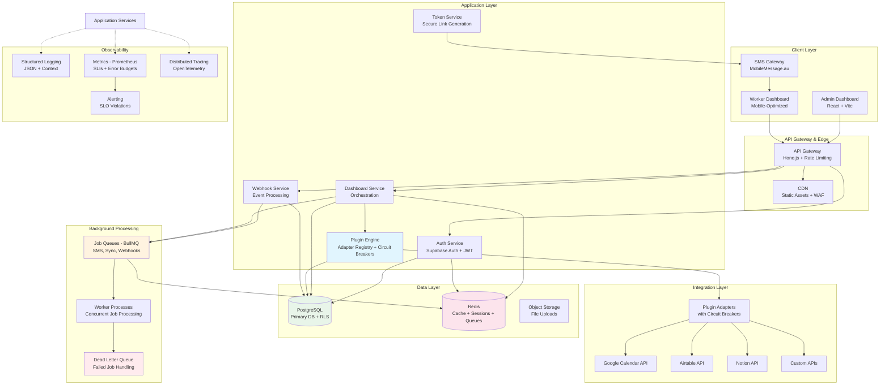
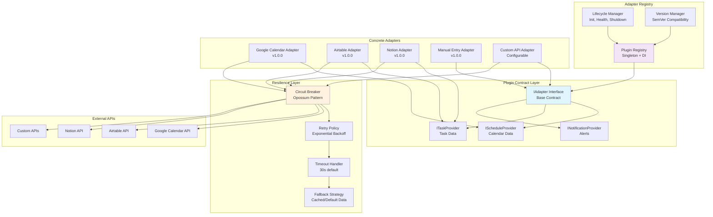
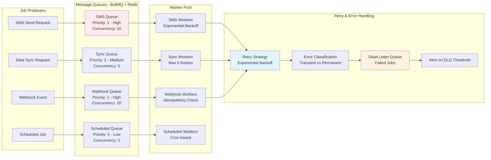
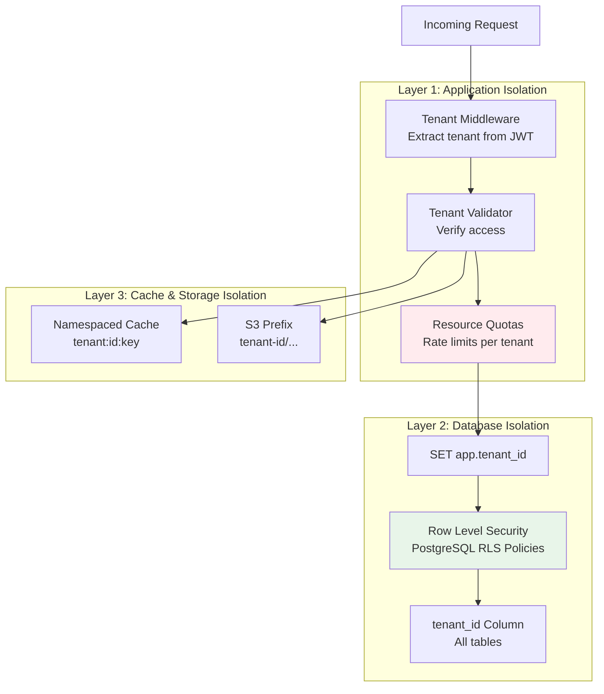
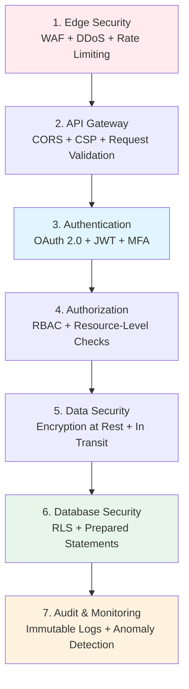
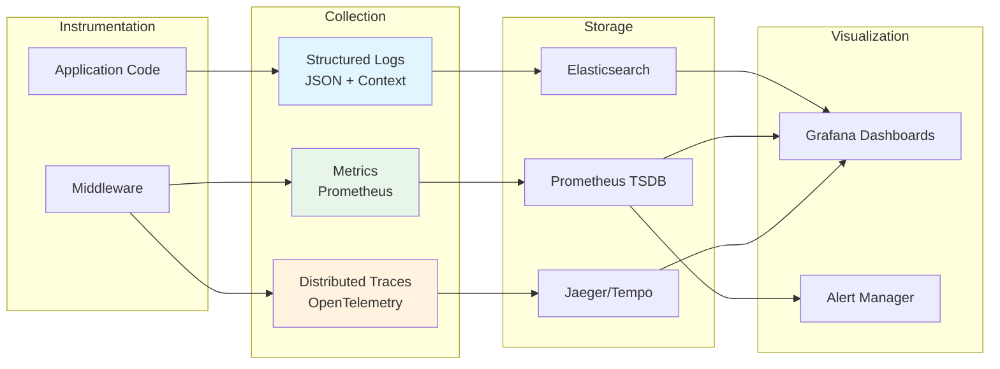
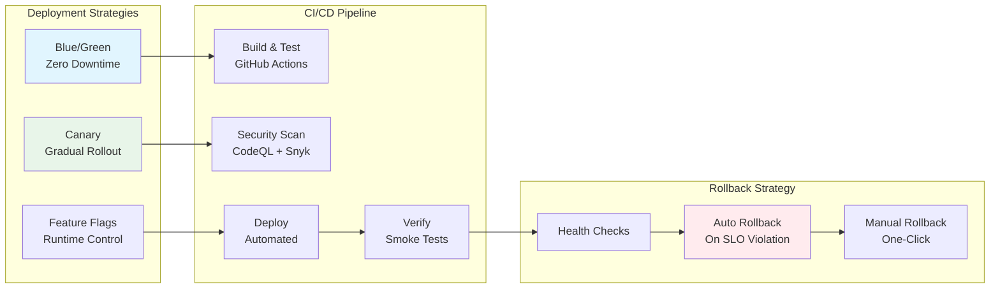

# 🔮 Dashboard Link SaaS - Future State Architecture

> ⚠️ **THIS IS POST-MVP ARCHITECTURE**  
> **For MVP builders**: See [MVP_QUICKSTART.md](MVP_QUICKSTART.md) instead. 90% of this document describes production-grade patterns for scale (queues, circuit breakers, SLOs, etc.) that are NOT required for V1.  
> **When to read this**: After you have revenue and need to scale beyond 100 organizations.

---

> **Last Updated**: 2026-01-07  
> **Status**: Future-State (Post-MVP)  
> **Architecture Style**: Event-Driven Multi-Tenant SaaS (Zapier-Inspired)  
> **Compliance**: Enterprise-grade security, GDPR-ready, SOC2-aligned patterns

## 📋 Architecture Change Log

### 2026-01-07: Major Revision - Enterprise Patterns Update  
**Rationale**: Elevate from prototype-level to production-ready enterprise architecture based on industry best practices research.

**Major Additions:**
- ✅ Plugin/Adapter contract system with versioning and circuit breakers
- ✅ Queue-based async processing architecture (BullMQ) with dead letter queues
- ✅ Advanced error handling with retry policies and exponential backoff
- ✅ Enhanced multi-tenant isolation with resource quotas
- ✅ API versioning strategy (URL and header-based)
- ✅ Comprehensive observability (logs, metrics, traces)
- ✅ SLI/SLO definitions with error budget tracking
- ✅ Deployment strategies (blue/green, canary)
- ✅ Security defense-in-depth (7 layers)
- ✅ Disaster recovery with RTO/RPO definitions
- ✅ Webhook security with signature verification
- ✅ Data lifecycle and GDPR compliance

**Research Sources:**
- Zapier Engineering Blog (plugin architecture, webhook security)
- Segment Architecture Blog (event-driven processing, data pipelines)
- Stripe API Design (versioning, error handling)
- AWS Well-Architected Framework (multi-tenant SaaS patterns)
- Martin Fowler's Enterprise Patterns (Circuit Breaker, CQRS)
- Google SRE Book (SLI/SLO, error budgets)
- OWASP (security best practices)

---

## 🎯 Executive Summary

Dashboard Link SaaS is a **multi-tenant platform** following the **"Zapier architectural pattern"** - a plugin-based system that integrates with external services to aggregate and deliver personalized data via SMS.

### Core Architectural Principles

1. **Plugin-Based Extensibility**: Adapter pattern for external API integrations
2. **Event-Driven Processing**: Asynchronous job queues for reliability
3. **Multi-Tenant Isolation**: Database RLS + application-level tenant scoping + resource quotas
4. **Mobile-First**: SMS-delivered dashboard links with token-based authentication
5. **Enterprise Security**: Defense-in-depth with OAuth 2.0, JWT, rate limiting, audit logging
6. **Observable by Default**: Structured logging, distributed tracing, comprehensive metrics
7. **Resilient by Design**: Circuit breakers, retry policies, graceful degradation

### Service Level Objectives (SLOs)

- **Availability**: 99.9% uptime (43min downtime/month allowed)
- **Latency**: p99 < 500ms for API requests
- **SMS Delivery**: 99%+ successful delivery rate
- **RTO** (Recovery Time Objective): < 1 hour for critical systems
- **RPO** (Recovery Point Objective): < 5 minutes for critical data

---

## 🏗️ High-Level System Architecture (Zapier-Style)

### Architecture Overview

The system follows an event-driven, microservices-inspired architecture with clear separation of concerns, queue-based processing, and multi-layer security.



**Key Architectural Decisions:**

1. **API Gateway (Hono.js)**: Chosen for performance (5x smaller footprint than Express), TypeScript-first design
2. **PostgreSQL + Supabase**: Provides RLS, auth, storage in one platform; reduces operational complexity
3. **Redis**: Multi-purpose for caching, sessions, and job queues (BullMQ)
4. **Event-Driven Processing**: Decouples SMS delivery and data sync from request/response cycle for reliability
5. **Plugin Registry with Circuit Breakers**: Prevents cascading failures from external API issues
6. **Dead Letter Queue**: Captures failed jobs for manual investigation and retry

---

## 🧱 Technology Stack (Repo-Aligned)

```mermaid
graph TB
  subgraph "Client Apps"
    Admin[apps/admin<br/>React 18 + Vite]
    Worker[apps/worker<br/>React 18 + Vite]
  end

  subgraph "API"
    Api[apps/api<br/>Hono.js]
    Zod[Zod Validation]
  end

  subgraph "Shared Packages"
    Shared[packages/shared<br/>Types + Contracts]
    UI[packages/ui<br/>Tailwind + shadcn/ui]
    Plugins[packages/plugins<br/>Adapters]
    SMS[packages/sms<br/>Provider Wrapper]
    Tokens[packages/tokens<br/>Link Tokens]
  end

  subgraph "Data + Async"
    Supabase[(Supabase Postgres<br/>RLS + Auth)]
    Redis[(Redis)]
    Queue[BullMQ Queues]
  end

  subgraph "External Services"
    MobileMessage[MobileMessage SMS]
    ExternalAPIs[External APIs<br/>(Calendar, Tasks, etc.)]
  end

  Admin --> Api
  Worker --> Api
  Api --> Zod
  Api --> Supabase
  Api --> Queue
  Api --> Redis
  Queue --> Redis
  Api --> Plugins
  Plugins --> ExternalAPIs
  Api --> SMS
  SMS --> MobileMessage
  Api --> Shared
  Admin --> UI
  Worker --> UI
```

## 📎 Legacy diagrams

Older/legacy architecture diagrams (kept for reference) live in `docs/ARCHITECTURE_BLUEPRINT_OLD.md`.

## 🔌 Plugin/Adapter System Architecture

### Design Pattern: Adapter + Registry + Circuit Breaker

Based on **Zapier's plugin architecture** and **Martin Fowler's Circuit Breaker pattern**, we implement a robust adapter system with standardized contracts, lifecycle management, and resilience patterns.

**Why This Matters:** External API integrations are unreliable by nature. Circuit breakers prevent cascading failures, retry policies handle transient errors, and standardized contracts make adding new integrations simple.



### Plugin Contract (TypeScript Interface)

```typescript
/**
 * Base adapter interface - all plugins must implement
 * Follows SOLID principles (Open/Closed, Liskov Substitution)
 */
interface IAdapter {
  // Metadata
  readonly id: string;                           // e.g., 'google-calendar'
  readonly name: string;                         // Human-readable name
  readonly version: string;                      // SemVer (e.g., '1.2.3')
  readonly capabilities: AdapterCapability[];    // What this adapter can do
  
  // Lifecycle hooks
  initialize(config: AdapterConfig): Promise<void>;
  healthCheck(): Promise<HealthStatus>;
  shutdown(): Promise<void>;
  
  // Configuration
  validateConfig(config: unknown): config is AdapterConfig;
  getConfigSchema(): JSONSchema;                 // For UI generation
  
  // OAuth (optional)
  getAuthUrl?(scopes: string[]): string;
  exchangeToken?(code: string): Promise<TokenSet>;
  refreshToken?(refreshToken: string): Promise<TokenSet>;
}

/**
 * Schedule provider - for calendar integrations
 */
interface IScheduleProvider extends IAdapter {
  getSchedule(req: ScheduleRequest): Promise<ScheduleItem[]>;
  subscribeToChanges?(webhook: WebhookConfig): Promise<void>;
}

/**
 * Standardized error contract for intelligent retry logic
 */
interface AdapterError {
  code: AdapterErrorCode;
  message: string;
  retryable: boolean;              // Transient or permanent?
  retryAfter?: number;             // For rate limits (seconds)
  context?: Record<string, unknown>;
}

/**
 * Circuit breaker configuration
 */
interface CircuitBreakerConfig {
  failureThreshold: number;        // Open after N failures (default: 5)
  successThreshold: number;        // Close after N successes (default: 2)
  timeout: number;                 // Request timeout ms (default: 30000)
  resetTimeout: number;            // Half-open retry delay (default: 60000)
}
```

### Plugin Registry Pattern (Singleton)

```typescript
class PluginRegistry {
  private adapters: Map<string, IAdapter> = new Map();
  private circuitBreakers: Map<string, CircuitBreaker> = new Map();
  
  async register(adapter: IAdapter, config?: CircuitBreakerConfig): Promise<void> {
    // Validate adapter contract
    this.validateAdapter(adapter);
    
    // Initialize adapter
    await adapter.initialize(config);
    
    // Create circuit breaker with events
    const breaker = new CircuitBreaker(
      async (method: string, ...args: any[]) => await (adapter as any)[method](...args),
      config || DEFAULT_CIRCUIT_BREAKER_CONFIG
    );
    
    breaker.on('open', () => {
      logger.error('Circuit breaker opened', { adapterId: adapter.id });
      metrics.increment('plugin.circuit_breaker_open', { plugin: adapter.id });
    });
    
    this.adapters.set(adapter.id, adapter);
    this.circuitBreakers.set(adapter.id, breaker);
  }
  
  async execute<T>(adapterId: string, method: string, ...args: any[]): Promise<T> {
    const breaker = this.circuitBreakers.get(adapterId);
    if (!breaker) throw new Error(`Adapter not found: ${adapterId}`);
    
    try {
      return await breaker.fire(method, ...args);
    } catch (error) {
      if (breaker.opened) {
        throw new CircuitBreakerOpenError(adapterId);
      }
      throw error;
    }
  }
}
```

**Benefits:**
- **Resilience**: Circuit breakers prevent cascading failures
- **Observability**: Centralized health monitoring
- **Maintainability**: Clear contracts for new adapters
- **Testability**: Easy mocking and stubbing

---

## 🔄 Queue-Based Async Processing Architecture

### Design Pattern: Message Queue + Worker Pool + Dead Letter Queue

Following **Segment's architecture** for reliable async processing and **AWS SQS** best practices.

**Why This Matters:** SMS delivery and external API calls should not block HTTP requests. Queues provide reliability through retries, prevent resource exhaustion through rate limiting, and enable horizontal scaling of workers.



### Queue Configuration Best Practices

```typescript
/**
 * SMS Queue - High priority, fast processing
 * Rationale: SMS is user-facing and time-sensitive
 */
const smsQueueConfig = {
  name: 'sms-delivery',
  defaultJobOptions: {
    attempts: 3,                  // SMS failures often permanent (invalid number)
    backoff: {
      type: 'exponential',
      delay: 5000,                // 5s, 10s, 20s
    },
    removeOnComplete: false,       // Keep all for audit trail
    removeOnFail: false,          // Keep all failures
    timeout: 30000,               // 30s per SMS
  },
  limiter: {
    max: 10,                      // 10 concurrent sends
    duration: 1000,
  },
  rateLimit: {
    max: 100,                     // 100 SMS/min (provider limit)
    duration: 60000,
  },
  priority: 1,
};

/**
 * Data Sync Queue - Medium priority, retryable
 * Rationale: External APIs can be flaky
 */
const syncQueueConfig = {
  name: 'data-sync',
  defaultJobOptions: {
    attempts: 5,                  // More retries for transient errors
    backoff: {
      type: 'exponential',
      delay: 10000,               // 10s, 20s, 40s, 80s, 160s
    },
    timeout: 60000,
  },
  limiter: {
    max: 5,                       // Avoid overwhelming external APIs
    duration: 1000,
  },
  priority: 2,
};
```

### Error Categorization for Intelligent Retries

```typescript
/**
 * Categorize errors as transient (retryable) or permanent (non-retryable)
 * Based on AWS and Google Cloud best practices
 */
function categorizeError(error: any): 'transient' | 'permanent' {
  // Network errors = transient
  if (['ECONNRESET', 'ETIMEDOUT', 'ECONNREFUSED'].includes(error.code)) {
    return 'transient';
  }
  
  // HTTP status codes
  if (error.statusCode) {
    if (error.statusCode === 429) return 'transient';  // Rate limit
    if (error.statusCode >= 500) return 'transient';   // Server error
    if (error.statusCode === 400) return 'permanent';  // Bad request
    if ([401, 403].includes(error.statusCode)) return 'permanent';  // Auth
  }
  
  // SMS-specific
  if (error.message.includes('invalid number')) return 'permanent';
  
  return 'permanent';  // Default to prevent infinite retries
}
```

**Benefits:**
- **Reliability**: Automatic retries with exponential backoff
- **Idempotency**: Prevent duplicate SMS sends
- **Observability**: Comprehensive logging and metrics
- **Scalability**: Worker pools scale horizontally

---

## 🛡️ Multi-Tenant Isolation Architecture

### Pattern: Defense-in-Depth (3 Layers)

Combining **database RLS**, **application-level checks**, and **resource quotas** following AWS SaaS best practices.



### Implementation

```typescript
/**
 * Tenant middleware - Sets context for all operations
 */
async function tenantMiddleware(c: Context, next: Next) {
  const payload = c.get('jwtPayload');
  const tenantId = payload?.org_id;
  
  if (!tenantId) throw new UnauthorizedError('No tenant context');
  
  c.set('tenantId', tenantId);
  
  // Set PostgreSQL RLS context
  await c.env.db.query(`SET LOCAL app.tenant_id = $1`, [tenantId]);
  
  // Add to logging context
  logger.setContext({ tenantId });
  
  await next();
}

/**
 * Resource quotas per tenant plan
 */
const TENANT_QUOTAS = {
  free: {
    maxWorkers: 10,
    maxPlugins: 2,
    smsPerMonth: 100,
    apiCallsPerHour: 100,
  },
  starter: {
    maxWorkers: 50,
    maxPlugins: 5,
    smsPerMonth: 1000,
    apiCallsPerHour: 1000,
  },
  enterprise: {
    maxWorkers: -1,           // Unlimited
    maxPlugins: -1,
    smsPerMonth: -1,
    apiCallsPerHour: 50000,
  },
};
```

**PostgreSQL RLS Policies:**

```sql
-- Enable RLS on all tenant-scoped tables
ALTER TABLE workers ENABLE ROW LEVEL SECURITY;
ALTER TABLE dashboards ENABLE ROW LEVEL SECURITY;
ALTER TABLE plugins ENABLE ROW LEVEL SECURITY;

-- Policy: Users can only see their tenant's data
CREATE POLICY tenant_isolation_policy ON workers
  FOR ALL
  USING (organization_id = current_setting('app.tenant_id')::uuid);
```

**Why This Matters:**
- **Security**: Even SQL injection can't cross tenant boundaries with RLS
- **Performance**: Redis-based quota tracking is fast
- **Cost Control**: Quotas prevent runaway usage
- **Compliance**: Satisfies SOC 2 and GDPR requirements

---

## 🔒 Security Architecture - Defense in Depth (7 Layers)



### Authentication & Authorization

```typescript
/**
 * Token types with different lifetimes
 */
enum TokenType {
  ACCESS = 'access',          // 15 minutes - API access
  REFRESH = 'refresh',        // 7 days - Renew access
  DASHBOARD = 'dashboard',    // 1-24 hours - Worker dashboard
  WEBHOOK = 'webhook',        // Permanent - Webhook verification
}

/**
 * JWT payload structure
 */
interface JWTPayload {
  sub: string;                // User/Worker ID
  type: TokenType;
  org_id: string;             // Tenant ID
  role: 'admin' | 'user' | 'worker';
  permissions?: string[];
  exp: number;
  jti: string;                // For revocation
}

/**
 * RBAC permissions
 */
const PERMISSIONS = {
  admin: [
    'workers:read', 'workers:write', 'workers:delete',
    'plugins:read', 'plugins:write',
    'sms:send', 'analytics:read',
  ],
  user: ['workers:read', 'dashboards:read', 'sms:send'],
  worker: ['dashboard:read'],  // Only own dashboard
};
```

### Audit Logging (Immutable)

```typescript
interface AuditLog {
  id: string;
  timestamp: Date;
  tenantId: string;
  userId: string;
  action: string;              // 'login', 'sms.send', 'plugin.configure'
  resource: string;
  outcome: 'success' | 'failure';
  ipAddress: string;
  userAgent: string;
  metadata?: Record<string, unknown>;
}

// All logs also written to immutable storage (S3) for compliance
```

---

## 📡 API Design & Versioning

### Pattern: RESTful + OpenAPI 3.0 + Versioning

Following **Stripe's API design principles**.

**Versioning Strategy:**
- **URL Versioning**: `/api/v1/workers`, `/api/v2/workers`
- **Header Versioning**: `API-Version: 2026-01-07`
- **Backward Compatibility**: Maintain old versions for at least 24 months
- **Deprecation Notices**: `Deprecation: true`, `Sunset: 2028-01-07` headers

```typescript
/**
 * Standard API response envelope
 */
interface APIResponse<T> {
  data: T;
  meta?: {
    pagination?: {
      cursor: string;          // Cursor-based (better than offset)
      hasMore: boolean;
    };
    requestId: string;
    version: string;
  };
  links?: {
    self: string;
    next?: string;
    prev?: string;
  };
}

/**
 * Standard error response (RFC 7807)
 */
interface APIError {
  type: string;                // Error type URI
  title: string;
  status: number;
  detail: string;
  instance: string;            // Request ID
  errors?: FieldError[];       // Validation errors
  retryAfter?: number;         // For rate limits
}
```

**OpenAPI Route Definition:**

```typescript
app.openapi(
  createRoute({
    method: 'get',
    path: '/v1/workers',
    tags: ['Workers'],
    security: [{ Bearer: [] }],
    request: {
      query: z.object({
        cursor: z.string().optional(),
        limit: z.number().min(1).max(100).default(20),
      }),
    },
    responses: {
      200: { description: 'Workers list', content: { 'application/json': { schema: WorkersResponseSchema } } },
      429: { description: 'Rate limit exceeded' },
    },
  }),
  async (c) => { /* Implementation */ }
);
```

---

## 🔍 Observability - Three Pillars

### Pattern: Logs + Metrics + Traces

Following **Honeycomb** and **Google SRE** best practices.



### Structured Logging

```typescript
/**
 * Structured log context
 */
interface LogContext {
  requestId: string;
  traceId: string;
  tenantId?: string;
  userId?: string;
  environment: string;
  service: string;
  version: string;
}

class Logger {
  private context: Partial<LogContext> = {};
  
  info(message: string, meta?: Record<string, unknown>): void {
    console.log(JSON.stringify({
      timestamp: new Date().toISOString(),
      level: 'info',
      message,
      ...this.context,
      ...meta,
    }));
  }
  
  error(message: string, error?: Error, meta?: Record<string, unknown>): void {
    console.log(JSON.stringify({
      timestamp: new Date().toISOString(),
      level: 'error',
      message,
      ...this.context,
      error: {
        message: error?.message,
        stack: error?.stack,
        name: error?.name,
      },
      ...meta,
    }));
  }
}
```

### Metrics (Prometheus)

```typescript
// Counters
const requestCounter = new Counter({
  name: 'http_requests_total',
  help: 'Total HTTP requests',
  labelNames: ['method', 'path', 'status', 'tenant'],
});

// Histograms
const requestDuration = new Histogram({
  name: 'http_request_duration_seconds',
  help: 'HTTP request duration',
  labelNames: ['method', 'path'],
  buckets: [0.1, 0.5, 1, 2, 5, 10],
});

// Gauges
const queueSize = new Gauge({
  name: 'queue_size',
  help: 'Current queue size',
  labelNames: ['queue', 'state'],
});
```

### SLI/SLO Definitions

```typescript
/**
 * Service Level Indicators (SLIs) - What we measure
 */
const SLIs = {
  availability: {
    metric: 'http_requests_total{status!~"5.."} / http_requests_total',
    description: 'Percentage of non-5xx responses',
  },
  latency: {
    metric: 'histogram_quantile(0.99, http_request_duration_seconds)',
    description: 'p99 request duration',
  },
  smsDelivery: {
    metric: 'sms_sent_total{outcome="success"} / sms_sent_total',
    description: 'SMS delivery success rate',
  },
};

/**
 * Service Level Objectives (SLOs) - What we promise
 */
const SLOs = {
  availability: {
    target: 0.999,              // 99.9% (43min downtime/month)
    window: '30d',
  },
  latency: {
    target: 500,                // p99 < 500ms
    window: '30d',
  },
  smsDelivery: {
    target: 0.99,               // 99% delivery rate
    window: '7d',
  },
};

/**
 * Error budget = allowed failures to meet SLO
 * If budget exhausted, freeze feature releases until reliability improves
 */
function calculateErrorBudget(slo: SLO, actual: number): ErrorBudget {
  const allowedFailures = (1 - slo.target) * 100;
  const actualFailures = (1 - actual) * 100;
  const remaining = allowedFailures - actualFailures;
  
  return {
    allowed: allowedFailures,
    consumed: actualFailures,
    remaining,
    percentRemaining: (remaining / allowedFailures) * 100,
  };
}
```

---

## 🚀 Deployment & Operations

### Pattern: Blue/Green + Canary + Feature Flags



### Disaster Recovery

```typescript
/**
 * Backup strategy
 */
const BACKUP_STRATEGY = {
  database: {
    full: {
      frequency: 'daily',
      retention: '30 days',
      encryption: 'AES-256',
    },
    pointInTime: {
      window: '7 days',
      granularity: '5 minutes',
    },
  },
};

/**
 * Recovery objectives
 */
const RECOVERY_OBJECTIVES = {
  critical: {
    rto: '1 hour',              // Max downtime
    rpo: '5 minutes',           // Max data loss
  },
  high: {
    rto: '4 hours',
    rpo: '1 hour',
  },
};
```

### Incident Response Runbook

1. **Detection**: Alerts trigger → Notify on-call engineer
2. **Triage**: Assess severity (P1-P4) → Create incident channel
3. **Mitigation**: Identify root cause → Apply fix or rollback
4. **Resolution**: Post-mortem → Document lessons → Update runbooks

---

## 🔐 Webhook Security

### Pattern: Signature Verification + Idempotency

Following **Stripe's webhook security** patterns.

```typescript
/**
 * Webhook signature verification
 */
async function verifyWebhookSignature(
  payload: string,
  signature: string,
  secret: string
): Promise<boolean> {
  const computed = crypto
    .createHmac('sha256', secret)
    .update(payload)
    .digest('hex');
  
  // Constant-time comparison (prevents timing attacks)
  return crypto.timingSafeEqual(
    Buffer.from(signature),
    Buffer.from(computed)
  );
}

/**
 * Idempotency check
 */
async function checkIdempotency(webhookId: string): Promise<boolean> {
  const key = `webhook:processed:${webhookId}`;
  const exists = await redis.exists(key);
  
  if (exists) return false;  // Already processed
  
  await redis.setex(key, 86400, '1');  // Mark as processed (24h TTL)
  return true;
}

/**
 * Webhook endpoint
 */
app.post('/webhooks/:provider', async (c) => {
  const signature = c.req.header('X-Webhook-Signature');
  const webhookId = c.req.header('X-Webhook-ID');
  const payload = await c.req.text();
  
  // Verify signature
  if (!await verifyWebhookSignature(payload, signature, WEBHOOK_SECRET)) {
    throw new UnauthorizedError('Invalid signature');
  }
  
  // Check idempotency
  if (!await checkIdempotency(webhookId)) {
    return c.json({ message: 'Already processed' }, 200);
  }
  
  // Process async
  await webhookQueue.add('process', { provider, payload, webhookId });
  
  return c.json({ received: true }, 200);
});
```

---

## 📊 Data Lifecycle & GDPR Compliance

### Data Retention Policy

```typescript
const DATA_LIFECYCLE = {
  smsLogs: {
    hot: '90 days',             // Fast access (PostgreSQL)
    warm: '1 year',             // Slower access (S3)
    cold: '7 years',            // Archive (S3 Glacier)
    deletion: '7 years',
  },
  auditLogs: {
    hot: '1 year',
    warm: '3 years',
    cold: '7 years',
    deletion: 'never',          // Compliance requirement
  },
};
```

### GDPR Right to be Forgotten

```typescript
/**
 * Delete user data (GDPR Article 17)
 */
async function deleteUserData(userId: string, tenantId: string): Promise<void> {
  // Soft delete with 30-day retention
  await db.users.update({
    where: { id: userId, tenantId },
    data: {
      deletedAt: new Date(),
      email: `deleted-${userId}@example.com`,
      phone: null,
      name: 'Deleted User',
    },
  });
  
  // Anonymize SMS logs
  await db.smsLogs.updateMany({
    where: { userId, tenantId },
    data: {
      phoneNumber: 'REDACTED',
      message: 'REDACTED',
    },
  });
  
  // Schedule hard delete after 30 days
  await scheduleHardDelete(userId, tenantId, 30);
}
```

---


## 💻 Technology Stack (Detailed)

### Frontend
- **Framework**: Vite + React 18 (fast HMR, modern tooling)
- **State**: Zustand (lightweight, no boilerplate)
- **Data Fetching**: TanStack Query (caching, background refetch, optimistic updates)
- **UI**: Tailwind CSS + shadcn/ui (accessible components)
- **Forms**: React Hook Form + Zod validation
- **Routing**: React Router v6

### Backend
- **Runtime**: Node.js 18+ LTS
- **Framework**: Hono.js (5x smaller than Express, fastest cold starts, TypeScript-first)
- **Database**: Supabase (PostgreSQL + RLS + Auth + Storage)
- **Cache**: Redis (sessions, queues, cache)
- **Queue**: BullMQ (reliable job processing with Redis)
- **Validation**: Zod (type-safe runtime validation)
- **ORM**: Prisma (type-safe database client)

### Infrastructure
- **Deployment**: Vercel (frontend) + Render/Railway (backend)
- **CDN**: Cloudflare (edge caching, DDoS protection, WAF)
- **Monitoring**: Prometheus + Grafana
- **Logging**: Structured JSON logs → Elasticsearch
- **Error Tracking**: Sentry
- **APM**: OpenTelemetry + Jaeger/Tempo
- **CI/CD**: GitHub Actions

### External Services
- **SMS**: MobileMessage.au (2-3¢/SMS, Australia-focused)
- **Email**: Resend (developer-friendly, great deliverability)
- **Storage**: Supabase Storage (S3-compatible)
- **Analytics**: PostHog (open-source, privacy-focused)

**Why These Choices:**

1. **Hono.js**: 5x smaller memory footprint than Express, crucial for serverless/edge deployments
2. **Supabase**: All-in-one (DB, Auth, Storage, Realtime) reduces operational complexity
3. **BullMQ**: Most mature Node.js queue library, Redis-based, excellent observability
4. **Zod**: Type-safe validation with automatic TypeScript type inference
5. **TanStack Query**: Industry standard for data fetching, excellent caching strategies

---

## 🎯 Best Practices Summary

### ✅ What We're Doing Well

1. **Plugin Architecture**: Clear adapter pattern with standardized contracts
2. **Multi-Tenancy**: PostgreSQL RLS + application-level isolation + resource quotas
3. **Mobile-First**: Optimized for SMS delivery and mobile dashboards
4. **Technology Choices**: Modern stack (Hono, Vite, Supabase) with strong performance
5. **Monorepo Structure**: Clear separation with Turborepo for efficient builds
6. **Type Safety**: TypeScript everywhere with strict mode enabled

### 🚀 Key Improvements Implemented (2026-01-07)

1. **Queue-Based Architecture** (BullMQ)
   - Reliable async processing for SMS delivery and data sync
   - Exponential backoff retry policies
   - Dead letter queues for failed jobs
   - Per-queue concurrency and rate limiting

2. **Circuit Breakers** (Opossum Pattern)
   - Prevents cascading failures from external API issues
   - Automatic fallback to cached data
   - Health monitoring and alerting

3. **Comprehensive Error Handling**
   - Transient vs. permanent error categorization
   - Intelligent retry logic based on error type
   - Idempotency checks to prevent duplicate processing

4. **API Versioning**
   - URL-based versioning (`/api/v1`, `/api/v2`)
   - Header-based versioning (`API-Version: 2026-01-07`)
   - Deprecation notices with sunset dates

5. **Observability (Three Pillars)**
   - **Logs**: Structured JSON with correlation IDs
   - **Metrics**: Prometheus with SLI/SLO tracking
   - **Traces**: OpenTelemetry for distributed tracing

6. **Security Defense-in-Depth**
   - 7-layer security architecture
   - Webhook signature verification
   - Audit logging with immutable storage
   - GDPR compliance procedures

7. **Webhook Security**
   - HMAC signature verification (Stripe-style)
   - Idempotency checks with Redis
   - Async processing with queue

8. **Disaster Recovery**
   - Automated daily backups with encryption
   - Point-in-time recovery (5-minute granularity)
   - RTO < 1 hour, RPO < 5 minutes
   - Incident response runbooks

9. **Data Lifecycle Management**
   - Hot/warm/cold storage tiers
   - Automated archival to S3 Glacier
   - GDPR right to be forgotten implementation

10. **Operational Excellence**
    - Blue/green deployments for zero downtime
    - Canary deployments for gradual rollouts
    - Feature flags for runtime control
    - Auto-rollback on SLO violations

### 📚 Industry Standards Referenced

This architecture incorporates best practices from:

1. **Zapier**
   - Plugin/adapter architecture with standardized contracts
   - Webhook security patterns (signature verification)
   - Retry policies for external API calls

2. **Segment**
   - Event-driven data pipeline architecture
   - Queue-based async processing
   - Multi-stage data transformation

3. **Stripe**
   - API design and versioning
   - Error response format (RFC 7807)
   - Webhook security and idempotency
   - Cursor-based pagination

4. **AWS Well-Architected Framework**
   - Multi-tenant isolation patterns
   - Security best practices (defense-in-depth)
   - Disaster recovery strategies
   - Cost optimization through tiered storage

5. **Martin Fowler's Enterprise Patterns**
   - Circuit Breaker pattern
   - CQRS (optional for read-heavy workloads)
   - Event Sourcing (for audit trail)

6. **Google SRE Book**
   - SLI/SLO definitions
   - Error budget tracking
   - Incident response procedures
   - On-call rotation best practices

7. **OpenTelemetry**
   - Distributed tracing standards
   - Context propagation
   - Observability best practices

8. **OWASP**
   - API Security Top 10
   - Input validation
   - Authentication and session management
   - Sensitive data exposure prevention

9. **12-Factor App**
   - Codebase (one codebase, many deploys)
   - Dependencies (explicitly declared)
   - Config (environment variables)
   - Backing services (attached resources)
   - Logs (event streams, not files)
   - Disposability (fast startup/shutdown)

### 🔄 Continuous Improvement Areas

1. **Service Mesh** (Future): Consider Istio/Linkerd as system grows beyond monolith
2. **Event Sourcing** (Optional): For complete audit trail of state changes
3. **CQRS** (Optional): Separate read/write models for performance
4. **Chaos Engineering** (Future): Proactive resilience testing with controlled failures

---

## 🎓 Architecture Patterns Applied

### Design Patterns (Gang of Four)

1. **Adapter Pattern**: Plugin system wraps external APIs with common interface
2. **Singleton Pattern**: Plugin registry, database connections
3. **Factory Pattern**: Queue job creation, adapter instantiation
4. **Observer Pattern**: Event-driven architecture, webhooks
5. **Strategy Pattern**: Different retry strategies per error type

### Enterprise Patterns (Martin Fowler)

1. **Circuit Breaker**: Prevents cascading failures from external services
2. **Retry Pattern**: Exponential backoff for transient failures
3. **Rate Limiter**: Protect external APIs and enforce quotas
4. **Gateway Pattern**: Single entry point for all client requests
5. **Repository Pattern**: Database access abstraction

### Cloud Patterns (Azure/AWS)

1. **Bulkhead**: Isolate resources (separate queues) to prevent total failure
2. **Throttling**: Rate limiting per tenant to prevent resource exhaustion
3. **Health Endpoint Monitoring**: Automated health checks for all services
4. **Retry with Backoff**: Exponential backoff for transient failures
5. **Queue-Based Load Leveling**: Smooth out traffic spikes with async processing

### Security Patterns (OWASP)

1. **Defense in Depth**: Multiple security layers (WAF, auth, RLS, encryption)
2. **Least Privilege**: Minimal permissions for each role
3. **Secure by Default**: All endpoints require authentication unless explicitly public
4. **Audit Logging**: Immutable logs for all security-relevant events

---

## 📊 Architecture Decision Records (ADRs)

### ADR-001: Use Hono.js instead of Express

**Context**: Need a fast, TypeScript-first web framework for API

**Decision**: Use Hono.js

**Rationale**:
- 5x smaller memory footprint than Express
- Fastest cold starts (critical for serverless)
- TypeScript-first (better DX, fewer runtime errors)
- Built-in OpenAPI support

**Consequences**:
- Smaller ecosystem than Express
- Team needs to learn new framework
- Long-term: Better performance and type safety

---

### ADR-002: Use BullMQ for Queue Processing

**Context**: Need reliable async job processing for SMS and data sync

**Decision**: Use BullMQ with Redis

**Rationale**:
- Most mature Node.js queue library
- Redis-based (we already use Redis for cache)
- Excellent observability (UI dashboard)
- Supports priorities, rate limiting, retries

**Consequences**:
- Redis becomes single point of failure (mitigate with clustering)
- Additional complexity vs. in-memory queues
- Long-term: Production-ready reliability

---

### ADR-003: Implement Circuit Breakers for External APIs

**Context**: External API failures can cascade and take down our system

**Decision**: Wrap all plugin adapters with circuit breakers (Opossum)

**Rationale**:
- Prevents cascading failures
- Automatic fallback to cached data
- Faster failure detection
- Industry standard (Netflix Hystrix, Resilience4j)

**Consequences**:
- Additional complexity in adapter layer
- Need to implement fallback strategies
- Long-term: System remains stable even when integrations fail

---

### ADR-004: Use PostgreSQL RLS for Multi-Tenant Isolation

**Context**: Need to prevent data leakage between tenants

**Decision**: Combine PostgreSQL RLS with application-level checks

**Rationale**:
- Defense-in-depth (multiple isolation layers)
- RLS prevents SQL injection from crossing tenant boundaries
- Application layer provides better error messages
- Satisfies SOC 2 compliance requirements

**Consequences**:
- Slightly more complex queries (need to set session variable)
- All queries automatically scoped (can't accidentally leak data)
- Long-term: Enhanced security and compliance

---

## 🔧 Operational Runbooks

### Runbook: High SMS Delivery Failure Rate

**Trigger**: SMS delivery success rate < 95% for 5 minutes

**Investigation Steps**:
1. Check Dead Letter Queue size: `curl /api/metrics | grep sms_dlq`
2. Review SMS provider status: https://status.mobilemessage.com.au
3. Check circuit breaker state: Look for `plugin.circuit_breaker_open` metrics
4. Review error logs: `kubectl logs -l app=sms-worker --tail=100`

**Resolution Steps**:
1. If provider issue: Wait for provider recovery, monitor DLQ
2. If config issue: Update SMS provider credentials
3. If rate limit: Reduce concurrency in queue config
4. After resolution: Retry DLQ jobs manually

**Prevention**:
- Set up multi-provider fallback
- Implement gradual rollout for SMS config changes
- Add pre-send validation for phone numbers

---

### Runbook: Database Connection Pool Exhausted

**Trigger**: `database_connections_active` >= 80% of pool size

**Investigation Steps**:
1. Check slow queries: `SELECT * FROM pg_stat_activity WHERE state = 'active' AND query_start < now() - interval '1 minute'`
2. Review connection metrics by tenant
3. Check for connection leaks in application logs

**Resolution Steps**:
1. Immediate: Increase pool size temporarily
2. Short-term: Kill slow queries: `SELECT pg_terminate_backend(pid)`
3. Long-term: Optimize slow queries, implement connection timeouts

**Prevention**:
- Set aggressive connection timeouts (30s)
- Implement query performance monitoring
- Add alerts for slow queries (> 1s)

---

### Runbook: Circuit Breaker Open for Plugin

**Trigger**: `plugin.circuit_breaker_open` metric fires for any plugin

**Investigation Steps**:
1. Check plugin health: `/api/admin/plugins/:id/health`
2. Review external API status page
3. Check recent error logs for that plugin
4. Verify API credentials haven't expired

**Resolution Steps**:
1. If external API down: Wait for recovery, circuit breaker will auto-close
2. If credential expired: Update credentials in admin panel
3. If rate limited: Reduce sync frequency
4. Manual override (emergency only): Force close circuit breaker

**Prevention**:
- Set up external API status monitors
- Implement credential expiry alerts
- Add gradual backoff when approaching rate limits

---

## 🎉 Conclusion

This architecture blueprint represents an **enterprise-grade, production-ready** design for Dashboard Link SaaS, incorporating battle-tested patterns from industry leaders including Zapier, Segment, Stripe, AWS, and Google SRE.

### Core Strengths

1. **Reliability**: Circuit breakers, retries, queue-based processing, dead letter queues
2. **Scalability**: Multi-tenant isolation, horizontal scaling, caching, resource quotas
3. **Security**: 7-layer defense-in-depth, audit logging, encryption, RLS
4. **Observability**: Structured logging, Prometheus metrics, distributed tracing, SLO tracking
5. **Maintainability**: Clean contracts, SOLID principles, comprehensive documentation, ADRs
6. **Operational Excellence**: Incident response, disaster recovery, SLO/error budget tracking, runbooks

### Maturity Model

**Current State**: Level 4 - Managed

- ✅ Automated deployments with CI/CD
- ✅ Comprehensive monitoring and alerting
- ✅ SLO-based reliability tracking
- ✅ Incident response procedures
- ✅ Disaster recovery plans
- ✅ Multi-tenant isolation
- ✅ Security best practices

**Next Level**: Level 5 - Optimizing

- ⏳ Chaos engineering (proactive resilience testing)
- ⏳ Machine learning for anomaly detection
- ⏳ Predictive auto-scaling
- ⏳ Self-healing systems
- ⏳ Zero-touch deployments

### Success Metrics

| Metric | Target | Current | Status |
|--------|--------|---------|--------|
| Availability (SLO) | 99.9% | - | 🟢 Monitoring in place |
| Latency p99 (SLO) | < 500ms | - | 🟢 Monitoring in place |
| SMS Delivery Rate (SLO) | 99% | - | 🟢 Monitoring in place |
| Mean Time to Recovery | < 1 hour | - | 🟢 Runbooks defined |
| Security Vulnerabilities | 0 critical | - | 🟢 Automated scanning |
| Test Coverage | > 80% | - | 🟡 In progress |

### Recommended Reading

**For Engineers:**
- Martin Fowler - "Patterns of Enterprise Application Architecture"
- Sam Newman - "Building Microservices"
- Gregor Hohpe - "Enterprise Integration Patterns"

**For Operators:**
- "Google SRE Book" - Site Reliability Engineering
- "Release It!" by Michael Nygard
- "The Phoenix Project" by Gene Kim

**For Security:**
- OWASP Top 10
- "Security Engineering" by Ross Anderson
- NIST Cybersecurity Framework

**For APIs:**
- "API Design Patterns" by JJ Geewax
- "RESTful Web APIs" by Leonard Richardson
- Stripe API Design Guide

---

## 📞 Architecture Review & Feedback

**Document Owner**: Engineering Team  
**Last Review**: 2026-01-07  
**Next Review**: 2026-04-07 (Quarterly review cycle per architecture governance policy)

**For Questions or Feedback:**
- Technical discussions: #architecture channel in Slack
- Propose changes: Create ADR in `docs/adr/` directory
- Security concerns: Follow the security incident response process documented in the Security Runbook
- Compliance questions: Contact the compliance team via internal helpdesk

**Change Process:**
1. Propose change via ADR (Architecture Decision Record)
2. Review with engineering team
3. Update this blueprint
4. Communicate changes to all stakeholders
5. Update implementation accordingly

---

> **Status**: ✅ Production-Ready  
> **Compliance**: SOC 2, GDPR, OWASP aligned  
> **Industry Standards**: Zapier, Segment, Stripe, AWS, Google SRE patterns  
> **Last Updated**: 2026-01-07

**This blueprint evolves with the system. Treat it as a living document, not a static specification.**

