```mermaid
graph TB
    subgraph "Your Core (Stable)"
        SMSService[SMS Service]
    end
    
    subgraph "Contract Layer"
        SMSProvider[SMSProvider Interface<br/>send: SMSMessage → SMSResult<br/>getStatus: messageId → SMSStatus]
    end
    
    subgraph "Primary Provider"
        TelstraAdapter[Telstra Adapter]
        Telstra[Telstra SMS API]
    end
    
    subgraph "Fallback Provider"
        TwilioAdapter[Twilio Adapter]
        Twilio[Twilio SMS API]
    end
    
    subgraph "Config"
        ProviderConfig[Provider Config<br/>primary: telstra<br/>fallback: twilio]
    end
    
    SMSService --> SMSProvider
    SMSProvider --> TelstraAdapter
    SMSProvider --> TwilioAdapter
    TelstraAdapter --> Telstra
    TwilioAdapter --> Twilio
    ProviderConfig --> SMSProvider
    
    style SMSProvider fill:#ffd43b,stroke:#000,stroke-width:3px
```

## 🔴 CRITICAL: The Abstraction Layer is Still Missing

### What Your Diagram Shows (Current)


**Problem:** Direct connections = Telstra API change breaks your SMS Service.

### What You Need (Zapier Standard)


**The yellow "Contract Layer" is missing from ALL your diagrams.**

---

## 📊 Detailed Gap Analysis

### 1. Plugin System - STILL WRONG ❌

**Your Current Diagram:**
```
Plugin Service → Google Calendar
Plugin Service → Airtable
Plugin Service → Notion
```

**What's Missing:**
```typescript
// YOU DON'T HAVE THIS:
interface PluginAdapter {
  getSchedule(workerId: string, dateRange: DateRange): Promise<PluginResponse<StandardScheduleItem>>;
  getTasks(workerId: string): Promise<PluginResponse<StandardTaskItem>>;
}

interface StandardScheduleItem {
  id: string;
  title: string;
  startTime: string; // ISO 8601
  endTime: string;
  location?: string;
  description?: string;
  metadata: Record<string, unknown>; // Google-specific stuff goes here
}

interface PluginResponse<T> {
  success: boolean;
  data: T[];
  errors?: PluginError[];
  metadata: {
    source: string;
    timestamp: string;
    version: string;
  };
}
```

**Why This Matters:**

**Current Architecture (Your Diagram):**
```typescript
// Your PluginService probably looks like this:
class PluginService {
  async getGoogleCalendarEvents(userId: string) {
    // Direct Google Calendar API call
    const response = await fetch('https://www.googleapis.com/calendar/v3/...');
    return response.items; // Returns Google's format
  }
  
  async getAirtableRecords(userId: string) {
    // Direct Airtable API call
    const response = await fetch('https://api.airtable.com/v0/...');
    return response.records; // Returns Airtable's format
  }
}

// Problem: Different return formats!
// Google returns: { items: [...] }
// Airtable returns: { records: [...] }
// Your dashboard code needs to handle both!
```

**Zapier Architecture (What You Need):**
```typescript
// Standard contract - YOUR format, never changes
interface PluginAdapter {
  getSchedule(...): Promise<PluginResponse<StandardScheduleItem>>;
}

// Google adapter transforms THEIR format to YOUR format
class GoogleCalendarAdapter implements PluginAdapter {
  async getSchedule(workerId: string, dateRange: DateRange): Promise<PluginResponse<StandardScheduleItem>> {
    // 1. Fetch from Google (THEIR API)
    const googleResponse = await fetch('https://www.googleapis.com/calendar/v3/...');
    
    // 2. Transform THEIR format to YOUR standard format
    const standardItems: StandardScheduleItem[] = googleResponse.items.map(item => ({
      id: item.id,
      title: item.summary,
      startTime: item.start.dateTime,
      endTime: item.end.dateTime,
      location: item.location,
      description: item.description,
      metadata: {
        googleEventId: item.id,
        htmlLink: item.htmlLink,
        attendees: item.attendees
        // All Google-specific data goes in metadata
      }
    }));
    
    // 3. Return YOUR standard response format
    return {
      success: true,
      data: standardItems,
      metadata: {
        source: 'google-calendar',
        timestamp: new Date().toISOString(),
        version: '1.0.0'
      }
    };
  }
}

// Airtable adapter ALSO returns YOUR format
class AirtableAdapter implements PluginAdapter {
  async getSchedule(workerId: string, dateRange: DateRange): Promise<PluginResponse<StandardScheduleItem>> {
    // Fetch from Airtable, transform to StandardScheduleItem
    // Returns same PluginResponse<StandardScheduleItem> format!
  }
}

// Your PluginService only knows about YOUR interface
class PluginService {
  private adapters: Map<string, PluginAdapter>;
  
  async getDashboardData(userId: string) {
    const results: StandardScheduleItem[] = [];
    
    // Iterate over ALL adapters - they all return the same format!
    for (const adapter of this.adapters.values()) {
      const response = await adapter.getSchedule(userId, getTodayRange());
      if (response.success) {
        results.push(...response.data);
      }
    }
    
    // All items are StandardScheduleItem - easy to combine!
    return results.sort((a, b) => a.startTime.localeCompare(b.startTime));
  }
}
```

**Impact:**
- **Current:** Google Calendar API v3 → v4 = update PluginService + Dashboard code
- **Zapier:** Google Calendar API v3 → v4 = update ONLY GoogleCalendarAdapter

---

### 2. SMS Service - STILL SINGLE POINT OF FAILURE ❌

**Your Diagram Shows:**
```
SMS Service → Telstra SMS API
```

**Problems:**
1. ❌ Only one SMS provider shown (Telstra)
2. ❌ No adapter interface shown
3. ❌ No fallback/redundancy
4. ❌ Direct dependency

**What You Need:**



**Implementation:**
```typescript
// Standard SMS interface (YOUR contract)
interface SMSProvider {
  id: string;
  send(message: SMSMessage): Promise<SMSResult>;
  getStatus(messageId: string): Promise<SMSStatus>;
}

interface SMSMessage {
  to: string;      // E.164 format
  body: string;
  from?: string;
  metadata?: Record<string, unknown>;
}

interface SMSResult {
  success: boolean;
  messageId: string;
  provider: string;
  timestamp: string;
  cost?: number;
  error?: string;
}

// Telstra adapter
class TelstraAdapter implements SMSProvider {
  id = 'telstra';
  
  async send(message: SMSMessage): Promise<SMSResult> {
    try {
      const response = await fetch('https://api.telstra.com/v2/messages/sms', {
        method: 'POST',
        headers: {
          'Authorization': `Bearer ${this.token}`,
          'Content-Type': 'application/json'
        },
        body: JSON.stringify({
          // Transform YOUR format to THEIR format
          to: message.to,
          body: message.body,
          from: message.from || 'CleanConnect'
        })
      });
      
      const data = await response.json();
      
      // Transform THEIR response to YOUR format
      return {
        success: true,
        messageId: data.messageId,
        provider: this.id,
        timestamp: new Date().toISOString(),
        cost: data.costInCents / 100
      };
    } catch (error) {
      return {
        success: false,
        messageId: '',
        provider: this.id,
        timestamp: new Date().toISOString(),
        error: error.message
      };
    }
  }
}

// Twilio adapter (fallback)
class TwilioAdapter implements SMSProvider {
  id = 'twilio';
  
  async send(message: SMSMessage): Promise<SMSResult> {
    // Different API, same interface!
    // Returns YOUR standard SMSResult
  }
}

// Your SMS Service - provider agnostic
class SMSService {
  private primary: SMSProvider;
  private fallback?: SMSProvider;
  
  constructor() {
    this.primary = new TelstraAdapter();
    this.fallback = new TwilioAdapter();
  }
  
  async sendDashboardLink(workerId: string, url: string): Promise<SMSResult> {
    const worker = await this.getWorker(workerId);
    
    // YOUR standard message format
    const message: SMSMessage = {
      to: worker.phone,
      body: `Your dashboard: ${url}`,
      metadata: { workerId, type: 'dashboard' }
    };
    
    // Try primary provider
    let result = await this.primary.send(message);
    
    // Automatic fallback if primary fails
    if (!result.success && this.fallback) {
      console.log('Primary SMS failed, trying fallback');
      result = await this.fallback.send(message);
    }
    
    // Log to database
    await this.logSMS(workerId, message, result);
    
    return result;
  }
}
```

**Benefits:**
- Telstra outage? Auto-switch to Twilio
- Telstra expensive? Switch primary/fallback in config
- Telstra API changes? Update only TelstraAdapter
- Add MessageBird? Create adapter, no core changes

---

### 3. Database Architecture - NO ABSTRACTION SHOWN ❌

**Your Diagram Shows:**
```
Core Services → PostgreSQL
```

**What's Missing:**
You're probably doing this throughout your codebase:
```typescript
// Direct PostgreSQL queries everywhere
const result = await pool.query(
  'SELECT * FROM workers WHERE organization_id = $1',
  [orgId]
);
```

**Problems:**
- ❌ PostgreSQL-specific SQL in 100+ files
- ❌ Can't switch to MySQL/MongoDB
- ❌ Can't add caching layer easily
- ❌ Hard to test (need real database)

**What You Need:**


**Implementation:**
```typescript
// Standard repository interface (YOUR contract)
interface Repository<T> {
  findById(id: string): Promise<T | null>;
  findMany(filter: RepositoryFilter): Promise<T[]>;
  create(data: Partial<T>): Promise<T>;
  update(id: string, data: Partial<T>): Promise<T>;
  delete(id: string): Promise<void>;
  count(filter: RepositoryFilter): Promise<number>;
}

interface RepositoryFilter {
  where?: Record<string, unknown>;
  orderBy?: { field: string; direction: 'asc' | 'desc' };
  limit?: number;
  offset?: number;
}

// PostgreSQL implementation
class PostgresWorkerRepository implements Repository<Worker> {
  async findMany(filter: RepositoryFilter): Promise<Worker[]> {
    // Build SQL query from YOUR standard filter
    let query = 'SELECT * FROM workers WHERE 1=1';
    const params: any[] = [];
    
    if (filter.where) {
      Object.entries(filter.where).forEach(([key, value], index) => {
        query += ` AND ${this.toSnakeCase(key)} = $${params.length + 1}`;
        params.push(value);
      });
    }
    
    if (filter.orderBy) {
      query += ` ORDER BY ${this.toSnakeCase(filter.orderBy.field)} ${filter.orderBy.direction}`;
    }
    
    const result = await this.pool.query(query, params);
    
    // Transform database rows to YOUR domain objects
    return result.rows.map(row => ({
      id: row.id,
      name: row.name,
      phone: row.phone,
      email: row.email,
      organizationId: row.organization_id, // snake_case → camelCase
      createdAt: row.created_at,
      updatedAt: row.updated_at
    }));
  }
  
  private toSnakeCase(str: string): string {
    return str.replace(/[A-Z]/g, letter => `_${letter.toLowerCase()}`);
  }
}

// Cached repository (decorator pattern)
class CachedWorkerRepository implements Repository<Worker> {
  constructor(
    private inner: Repository<Worker>,
    private cache: Redis
  ) {}
  
  async findById(id: string): Promise<Worker | null> {
    // Check cache first
    const cached = await this.cache.get(`worker:${id}`);
    if (cached) return JSON.parse(cached);
    
    // Fallback to inner repository (PostgreSQL)
    const worker = await this.inner.findById(id);
    if (worker) {
      await this.cache.set(`worker:${id}`, JSON.stringify(worker), 'EX', 300);
    }
    
    return worker;
  }
  
  async findMany(filter: RepositoryFilter): Promise<Worker[]> {
    // Delegate to inner repository
    return await this.inner.findMany(filter);
  }
}

// In-memory repository (for testing)
class InMemoryWorkerRepository implements Repository<Worker> {
  private data: Map<string, Worker> = new Map();
  
  async findById(id: string): Promise<Worker | null> {
    return this.data.get(id) || null;
  }
  
  async findMany(filter: RepositoryFilter): Promise<Worker[]> {
    let results = Array.from(this.data.values());
    
    if (filter.where) {
      results = results.filter(item => {
        return Object.entries(filter.where!).every(([key, value]) => {
          return (item as any)[key] === value;
        });
      });
    }
    
    return results;
  }
}

// Your service uses the interface - doesn't care about implementation
class WorkerService {
  constructor(private repo: Repository<Worker>) {}
  
  async getOrganizationWorkers(orgId: string): Promise<Worker[]> {
    // YOUR standard filter format
    return await this.repo.findMany({
      where: { organizationId: orgId, active: true },
      orderBy: { field: 'name', direction: 'asc' }
    });
  }
}

// Dependency injection - swap implementations easily
const workerService = new WorkerService(
  new CachedWorkerRepository(
    new PostgresWorkerRepository(pool),
    redisClient
  )
);

// For testing
const testWorkerService = new WorkerService(
  new InMemoryWorkerRepository()
);
```

---

### 4. Authentication - VENDOR LOCK-IN ❌

**Your Diagram Shows:**
```
API → Authentication → (No detail shown)
```

**You're Probably Using:**
```typescript
// Direct auth provider throughout codebase
import { supabase } from './supabase';

async function login(email: string, password: string) {
  const { data, error } = await supabase.auth.signInWithPassword({
    email,
    password
  });
  return data;
}
```

**Problem:**
- ❌ Supabase Auth calls in 20+ files
- ❌ Enterprise customer wants Okta SSO? Complete rewrite
- ❌ Supabase Auth API changes? Update everywhere

**What You Need:**

```typescript
// Standard auth interface (YOUR contract)
interface AuthProvider {
  id: string;
  signIn(credentials: AuthCredentials): Promise<AuthResult>;
  signOut(userId: string): Promise<void>;
  refreshToken(refreshToken: string): Promise<AuthResult>;
  validateToken(token: string): Promise<AuthUser>;
}

interface AuthCredentials {
  email: string;
  password: string;
  metadata?: Record<string, unknown>;
}

interface AuthResult {
  success: boolean;
  user?: AuthUser;
  token?: string;
  refreshToken?: string;
  error?: string;
}

interface AuthUser {
  id: string;
  email: string;
  metadata: Record<string, unknown>;
}

// Supabase adapter
class SupabaseAuthProvider implements AuthProvider {
  id = 'supabase';
  
  async signIn(credentials: AuthCredentials): Promise<AuthResult> {
    try {
      const { data, error } = await this.client.auth.signInWithPassword({
        email: credentials.email,
        password: credentials.password
      });
      
      if (error) throw error;
      
      // Transform THEIR format to YOUR format
      return {
        success: true,
        user: {
          id: data.user.id,
          email: data.user.email,
          metadata: data.user.user_metadata
        },
        token: data.session.access_token,
        refreshToken: data.session.refresh_token
      };
    } catch (error) {
      return {
        success: false,
        error: error.message
      };
    }
  }
}

// Auth0 adapter (for enterprise)
class Auth0Provider implements AuthProvider {
  id = 'auth0';
  
  async signIn(credentials: AuthCredentials): Promise<AuthResult> {
    // Different API, same interface!
    // Returns YOUR standard AuthResult
  }
}

// Your auth service - provider agnostic
class AuthService {
  private provider: AuthProvider;
  
  constructor() {
    // Load from config
    this.provider = config.authProvider === 'auth0'
      ? new Auth0Provider()
      : new SupabaseAuthProvider();
  }
  
  async login(email: string, password: string): Promise<AuthResult> {
    // YOUR standard interface
    return await this.provider.signIn({ email, password });
  }
}
```

---

## 🎯 The Pattern You're Missing

### Your Current Pattern:
```
Service → External API
```
**Problem:** External API changes = Your service breaks

### Zapier Pattern:
```
Service → Interface → Adapter → External API
              ↑
        The Contract Layer
```
**Solution:** External API changes = Update adapter only

---

## 📊 Updated Architecture Needed

Here's what your "High-Level System Architecture" diagram should look like:

```mermaid
graph TB
    subgraph "Frontend Layer"
        Web[Web Dashboard]
        Mobile[Mobile App]
        Admin[Admin Panel]
    end
    
    subgraph "API Gateway Layer"
        API[API Gateway]
        Auth[Auth Middleware]
        RateLimit[Rate Limiter]
    end
    
    subgraph "Service Layer (Your Core)"
        UserService[User Service]
        DashboardService[Dashboard Service]
        SMSService[SMS Service]
        PluginService[Plugin Service]
    end
    
    subgraph "Contract Layer (THE MISSING PIECE)"
        style Contract fill:#ffd43b,stroke:#000,stroke-width:4px
        Contract[Provider Interfaces<br/>────────────────<br/>SMSProvider<br/>PluginAdapter<br/>Repository<br/>AuthProvider<br/>PaymentProvider]
    end
    
    subgraph "Adapter Layer (Swappable)"
        TelstraAdapter[Telstra SMS]
        TwilioAdapter[Twilio SMS]
        GoogleAdapter[Google Calendar]
        PostgresAdapter[PostgreSQL]
        CacheAdapter[Redis Cache]
        StripeAdapter[Stripe]
    end
    
    subgraph "External Services"
        Telstra[Telstra API]
        Twilio[Twilio API]
        Google[Google API]
        Postgres[(PostgreSQL)]
        Redis[(Redis)]
        Stripe[Stripe API]
    end
    
    Web --> API
    Mobile --> API
    Admin --> API
    
    API --> Auth
    API --> RateLimit
    API --> UserService
    API --> DashboardService
    API --> SMSService
    API --> PluginService
    
    UserService --> Contract
    DashboardService --> Contract
    SMSService --> Contract
    PluginService --> Contract
    
    Contract --> TelstraAdapter
    Contract --> TwilioAdapter
    Contract --> GoogleAdapter
    Contract --> PostgresAdapter
    Contract --> CacheAdapter
    Contract --> StripeAdapter
    
    TelstraAdapter --> Telstra
    TwilioAdapter --> Twilio
    GoogleAdapter --> Google
    PostgresAdapter --> Postgres
    CacheAdapter --> Redis
    StripeAdapter --> Stripe
```



**Key Change:** The yellow "Contract Layer" box is the critical missing piece.

---

## 🔍 Your Specific Improvements vs Remaining Gaps

### ✅ What You Improved:
1. Better organization of services
2. Clearer separation of concerns
3. Good high-level structure
4. Comprehensive service breakdown

### ❌ What's Still Missing:
1. **Contract Layer** - No standard interfaces shown
2. **Adapter Pattern** - No transformation layer shown
3. **Provider Abstraction** - Direct external dependencies
4. **Data Contracts** - No standard data shapes defined

---

## 💡 Real-World Scenario Test

**Question:** If Telstra's SMS API goes down for 4 hours tomorrow, what happens?

**Your Current Architecture:**
```typescript
// SMSService.ts
async sendSMS(phone: string, message: string) {
  // Direct Telstra API call
  const response = await fetch('https://api.telstra.com/v2/messages/sms', {
    // Telstra-specific code
  });
  
  // Returns Telstra-specific format
  return response;
}
```
**Result:** ❌ Your entire SMS system is down for 4 hours. Can't send any dashboard links.

**Zapier Architecture:**
```typescript
// SMSService.ts
async sendSMS(phone: string, message: string) {
  const message: SMSMessage = { to: phone, body: message };
  
  // Try primary
  let result = await this.primary.send(message);
  
  // Auto-fallback
  if (!result.success && this.fallback) {
    result = await this.fallback.send(message);
  }
  
  return result;
}
```
**Result:** ✅ Primary (Telstra) fails, automatically switches to Twilio. Dashboard links keep sending.

---

## 🎯 Final Verdict

### Current Grade: C+ (70%)

**What You Have:**
- ✅ Good service organization (A)
- ✅ Clear architecture diagrams (A)
- ✅ Comprehensive system overview (B+)
- ❌ **No abstraction layer (F)**
- ❌ **No provider interfaces (F)**
- ❌ **Direct external dependencies (F)**

**What Zapier Has:**
```typescript
// Zapier's actual approach
interface ActionProvider {
  execute(input: StandardInput): Promise<StandardOutput>;
}

// They have 6000+ integrations, but only ONE interface
```

### To Reach A+ (Zapier Level):

1. **Add Contract Layer** (Week 1-2)
   - Define `PluginAdapter`, `SMSProvider`, `Repository<T>`, `AuthProvider`
   - Create standard data shapes: `StandardScheduleItem`, `SMSMessage`, `AuthResult`

2. **Implement Adapters** (Week 3-4)
   - Wrap Telstra in `TelstraAdapter implements SMSProvider`
   - Wrap Google Calendar in `GoogleCalendarAdapter implements PluginAdapter`
   - Wrap PostgreSQL in `PostgresRepository implements Repository<T>`

3. **Update Services** (Week 5)
   - Change services to use interfaces, not concrete implementations
   - Add dependency injection
   - Remove direct external API calls

4. **Add Fallbacks** (Week 6)
   - SMS: Primary + Fallback provider
   - Plugins: Graceful degradation
   - Database: Read replicas

---

## 🚨 Bottom Line

Your diagrams look professional, but they're **hiding the critical flaw**: **no abstraction layer**.

It's like showing a beautiful house blueprint without showing the foundation. Everything looks great until an earthquake (external API change) hits.

**The fix:** Add the yellow "Contract Layer" box to your diagrams, and **actually implement it in code**.

Then you'll be Zapier-level.

**Current Status:** Pretty diagrams, fragile architecture  
**Needed Status:** Boring interfaces, bulletproof architecture

The most important diagram you need to add is the one I showed above with the yellow "Contract Layer" box. That's the missing piece.